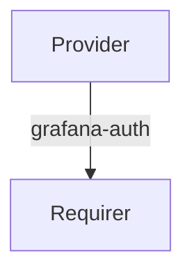

# `grafana-auth`

## Usage

This relation interface describes the expected behavior of any charm claiming to be able to provide or consume `Grafana` authentication configuration data.

The interface will consist of a `provider` and a `requirer`. The `provider` is expected to allow configurable authentication to `Grafana`, while the `requirer` should be able to consume the relation and configure the authentication mode to authenticate to `Grafana`.

## Direction
`grafana-auth` interface implements a provider/requirer pattern.
The `provider` is expected to allow configurable authentication to `Grafana`.
The `requirer` should be able to consume the relation and configure the authentication mode to authenticate to `Grafana`.

## Behavior

Both the Requirer and the provider need to adhere to a certain set of criteria to be considered compatible with the interface.

### Provider

- Is expected to allow configuration of authentication mode to `Grafana` as specified by the `requirer`. The modes that can be used are listed in Grafana's [official documentation](https://grafana.com/docs/grafana/latest/setup-grafana/configure-security/configure-authentication/)

### Requirer

- Is expected to provide the preferred authentication mode with the required configuration towards the provider using a top-level key in the application databag to group the whole authentication config together.

## Relation Data

### Provider
[\[JSON Schema\]](./schemas/provider.json)

### Requirer
[\[JSON Schema\]](./schemas/requirer.json)
The requirer provides the authentication mode and its configuration.
- Possible modes: 
  - azuread
  - generic_oauth
  - google
  - jwt
  - gitlab
  - ldap
  - okta
  - proxy
  - github
  - anonymous
  - basic
