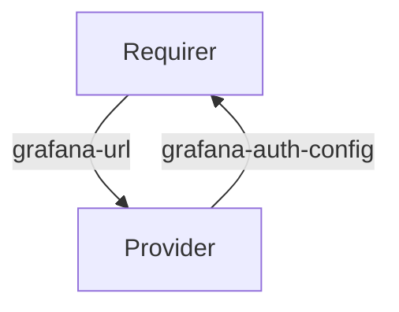

# `grafana-auth`

## Usage

This relation interface describes the expected behavior of any charm claiming to be able to provide or consume `Grafana` authentication configuration data.

## Direction

The interface will consist of a provider and a requirer.
The `requirer` is expected to allow configurable authentication to `Grafana`. and the `requirer` should be able to consume the relation and configure the authentication mode to authenticate to `Grafana`.



## Behavior

Both the `requirer` and the `provider` need to adhere to a certain set of criteria to be considered compatible with the interface.

### Provider

- Is expected to provide the `requirer` with the configuration for the preferred authentication mode.
- Is expected to group any authentication config in a top-level key in the application databag.

### Requirer

- Is expected to allow configuration of authentication mode to `Grafana` as specified by the `provider`. The modes and their configurations are described in Grafana's [official documentation](https://grafana.com/docs/grafana/latest/setup-grafana/configure-security/configure-authentication/)
- Is expected to configure Grafanas authentication as described by the `provider`.
- Is expected to advertise its publicly reachable URL to the `provider`.

## Relation Data

### Provider

[\[JSON Schema\]](./schemas/provider.json)

The `provider` provides the authentication mode and its configuration.
- Supported modes:
  - proxy

#### Example

```json
{
  "auth": {
    "proxy": {
      "header_name": "X-WEBAUTH-USER",
      "header_property": "username",
      "auto_sign_up": false,
    }
  }
}
```

### Requirer

[\[JSON Schema\]](./schemas/requirer.json)
The `provider` returns a `url` that the `requirer` charm uses as needed.

#### Example

```json
{
  "url": "https://grafana.example.com/"
}
```