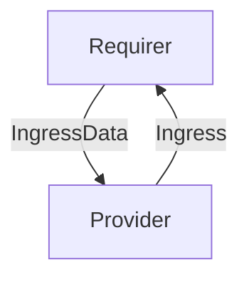

# `ingress`

## Usage

This relation interface describes the expected behavior of any charm claiming to be able to provide or consume ingress data.

In most cases, this will be accomplished using the [ingress library](https://github.com/canonical/traefik-k8s-operator/blob/main/lib/charms/traefik_k8s/v0/ingress.py), although charm developers are free to provide alternative libraries as long as they fulfill the behavioral and schematic requirements described in this document.

## Direction
The `ingress` interface implements a provider/requirer pattern.
The consumer is a charm that wishes to receive ingress, and the provider is a charm able to provide it.



## Behavior

The requirer and the provider need to adhere to a certain set of criteria to be considered compatible with the interface.

### Provider

- Can provide ingress for the remote applications requesting it.
- Is expected to respect the ingress parameters sent by the requirer: hostname, port and model name (namespace).
- Is expected to publish the ingress url via relation data.

### Requirer

- Is expected to be able to provide a hostname, a port, the name of the (leader) unit requesting ingress, and a model name (namespace). 

## Relation Data

### Provider

[\[JSON Schema\]](./schemas/provider.json)

Exposes a `url` field containing the url at which ingress is available. Should be placed in the **application** databag, encoded as yaml and nested in a "data" field.

#### Example

```yaml
application_data: {
  data: {
    url: "http://foo.bar:80/model_name-unit_name/0"
  }
}
```

### Requirer

[\[JSON Schema\]](./schemas/requirer.json)

Exposes the unit name, model name, hostname and port at which ingress should be provided. Should be placed in the **application** databag, encoded as yaml and nested in a "data" field.

#### Example
```yaml
application-data: {
  data: {
     name: "unit-name",
     host: "hostname",
     port: 4242,
     model: "model-name"
  }          
}
```


