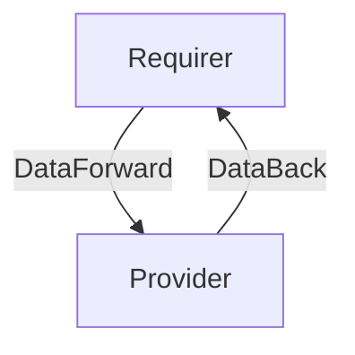

# `my-interface-name`

## Usage

Describe the expected usage of the relation interface.

## Direction

If this interface implements a provider/requirer pattern, describe the directionality of the relation and its meaning.
It would be good to have a mermaid chart to explain further:



## Behavior

Describe as clearly as possible criteria that the requirer and the provider need to adhere to, to be considered compatible with the interface.

### Provider

- List of expectations that the provider needs to fulfill. For example
- Is expected to publish the ingress url in its application databag.
  The url is expected to have the following structure:

    > `http://[ingress hostname]:[ingress port]/[app-name]-[model-name]/`
    

### Requirer

- List of expectations that the requirer needs to fulfill. For example
- Is expected to be able to provide a hostname, a port, the name of the (leader) unit requesting ingress, and a model name (namespace). 

## Relation Data

Describe the contents of the databags, and provide schemas for them.

### Provider

[\[JSON Schema\]](./schemas/provider.json)


#### Example

Provide examples of valid databags.

```yaml
application_data: {
  url: "http://foo.bar:80/model_name-unit_name/0"
}
```

### Requirer

[\[JSON Schema\]](./schemas/requirer.json)

#### Example
```yaml
application-data: {
 name: "unit-name",
 host: "hostname",
 port: 4242,
 model: "model-name"
}
```
