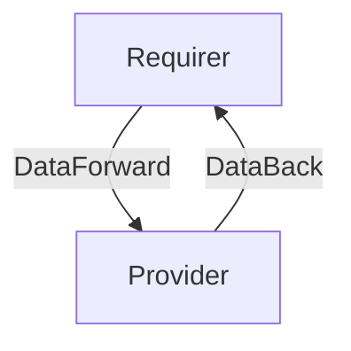

# `name-of-this-interface`

## Usage

Describe the expected usage of the relation interface.

## Direction

If this interface implements a provider/requirer pattern, describe the directionality of the relation and its meaning.
It would be good to have a mermaid chart to explain further:



## Behavior

Describe as clearly as possible criteria that the requirer and the provider need to adhere to, to be considered compatible with the interface.

### Provider

- List of expectations that the provider needs to fulfill. 
    

### Requirer

- List of expectations that the requirer needs to fulfill.
- 
## Relation Data

Describe the contents of the databags, and provide schemas for them.

[\[Pydantic Schema\]](./schema.py)

#### Example
Provide a yaml/json example of a valid databag state (for the whole relation).
```yaml
provider:
  app: {}
  unit: {}
requirer:
  app: {}
  unit: {}
```
