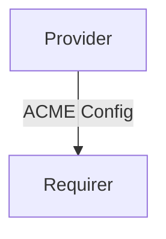

# ACME Config

## Usage

This relation interface describes the expected behavior of any charm claiming to be able to provide configurations for another charm that uses the ACME protocol. You can read more about ACME [here](https://letsencrypt.org/docs/client-options/).

## Direction

The interface will consist of a provider and a requirer.



## Behavior

Both the Requirer and the provider need to adhere to a certain set of criterias to be considered
compatible with the interface.

### Provider

- Is expected to provide general configurations necessary to communicate with the ACME
  server (`email`, `server`, `agree to terms of services`)
- Is expected to provide the ACME challenge it wants (`DNS-01` or `HTTP-01`)
- Is expected to provide the challenge specific configurations (optional)

### Requirer

- Is expected to use the ACME protocol with the provided configuration to retrieve TLS
  certificates.

## Relation Data

### Provider

[\[JSON Schema\]](./schemas/provider.json)

### Requirer

[\[JSON Schema\]](./schemas/requirer.json)

#### Example

```yaml
application-data:
  email: "example@canonical.com"
  server: "https://www.lets_encrypt.com"
  agree_tos: true
  challenge_name: "DNS-01"
  challenge_config: {
    "provider": "cloudflare",
    "CF_API_EMAIL": "example@canonical.com",
    "CF_API_KEY": "abcd1234efgh"
  }
```
