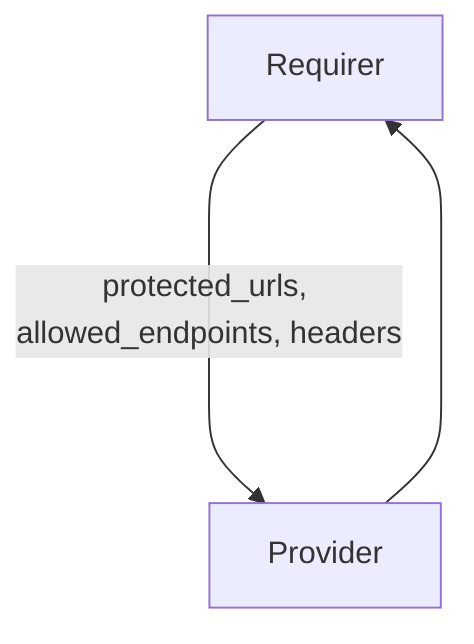

# `auth_proxy`

## Usage

This relation interface describes the expected behavior of charms claiming to be able to interact with Policy Decision Point (Oathkeeper), which forms part of Identity and Access Proxy (IAP).

## Direction

The interface will consist of a provider and a requirer.

The requirer is expected to supply configuration required to set up an Identity and Access Proxy: protected urls, allowed endpoints and headers.

The provider will read the information from the application databag, transform them into access rules and forward relevant configuration to Traefik or other API Gateway. It will not write to the application databag.



## Behavior

Both the requirer and the provider need to adhere to a certain set of criteria to be considered compatible with the interface:

### Provider

- Is expected to serve Access Control Decision API
- Is expected to provide a Policy Decision Point in IAP architecture
- Is expected to transform incoming `auth_proxy` configuration into access rules, enforcing user authentication for requests hitting the protected urls, with the exception of allowed endpoints.

### Requirer

- Is expected to have ingress configured, e.g. with the use of traefik's `ingress-per-app/leader/unit` interface
- Is expected to provide configuration required to set up access rules: protected urls (externally accessible ingress urls), allowed endpoints and headers.

## Relation Data

### Provider

[\[JSON Schema\]](./schemas/provider.json)

n/a

### Requirer

[\[JSON Schema\]](./schemas/requirer.json)


#### Example

```json
{
  "application_data": {
    "protected_urls": ["https://10.64.140.43/unit-0", "https://10.64.140.43/unit-1"],
    "allowed_endpoints": ["about/app"],
    "headers": ["X-User"]
  }
}
```
