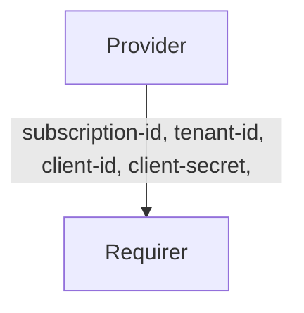

# `azure_service_principal`

## Usage

This relation interface describes the expected behavior of any charm claiming to be able to interact with Microsoft Entra ID using service principal credentials. This interface should be used whenever a charm wants to be relayed the service principal credentials needed to access Entra ID objects such as Azure storage.

## Direction

## Behavior

To be considered compatible with the interface, the requirer and the provider need to adhere to the following criteria:

### Provider
The provider is expected to share with all requirer charms the credentials required to be able to connect to Azure resources.

### Requirer
- Is expected to have unique credentials for each relation. Therefore. different instances of the same charm will have unique relations with different credentials.
- Is expected to have different relation names with the same interface if access using different credentials is needed.

## Relation Data

### Provider

### Requirer
