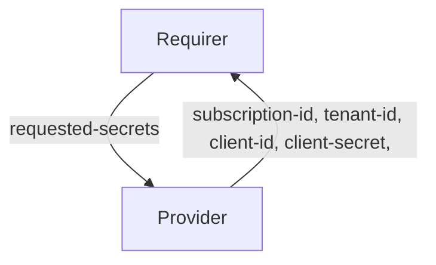

# `azure_service_principal`

## Usage

This relation interface describes the expected behavior of any charm claiming to be able to interact with Microsoft Entra ID using service principal credentials. This interface should be used whenever a charm wants to be relayed the service principal credentials needed to access Entra ID objects such as Azure storage.

In most cases, implementation of the interface is handled via the [data_interfaces](https://github.com/canonical/data-platform-libs/blob/main/lib/charms/data_platform_libs/v0/data_interfaces.py) library, although charm developers can use other libraries as long as they fulfill the requirements described in this document.

## Direction



## Behavior

To be considered compatible with the interface, the requirer and the provider need to adhere to the following criteria:

### Provider
- Is expected to share with all requirer charms the credentials required to be able to connect to Azure resources.

### Requirer
- Is expected to provide `requested-secrets`, which is a list of fields names that are not to be exposed in the relation databag, but handled with Juju secrets. The format should be a JSON parsable array of strings, and correspond to valid Juju secret keys. The secret fields must contain `client-id` and `client-secret`.
- Is expected to have unique credentials for each relation. Therefore. different instances of the same charm will have unique relations with different credentials.
- Is expected to have different relation names with the same interface if access using different credentials is needed.

## Relation Data

### Provider
[\[JSON Schema\]](../../../docs/json_schemas/azure_service_principal/v0/provider.json)

The provider gives connection and authentication information:

- **subscription-id** (str): Identifier for an Azure subscription.
- **tenant-id** (str): Identifier of an Entra ID tenant.
- **client-id** (str): Client ID for the service principal.
- **client-secret** (str): Client secret for the service principal.


#### Example
```yaml
  relation-info:
  - endpoint: azure_service_principal
    related-endpoint: azure_service_principal
    application-data:
      subscription-id: 12345678-1234-1234-1234-1234567890ab
      tenant-id: 87654321-4321-4321-4321-ba0987654321
      client-id: a1b2c3d4-e5f6-a7b8-c9d0-e1f2a3b4c5d6
      client-secret: aBcDeFgHiJkLmNoPqRsTuVwXyZ123456-~7890_
```


### Requirer
[\[JSON Schema\]](../../../docs/json_schemas/azure_service_principal/v0/requirer.json)

The requirer shares a list of the requested Juju secrets that should be shared by the provider charm:

- **requested-secrets** (list): List of Juju secret keys that the provider must share. Must include `client-id` and `client-secret`.

#### Example
```yaml
  relation-info:
  - endpoint: azure_service_principal
    related-endpoint: azure_service_principal
    application-data:
      requested-secrets: ["client-id", "client-secret"]
```
