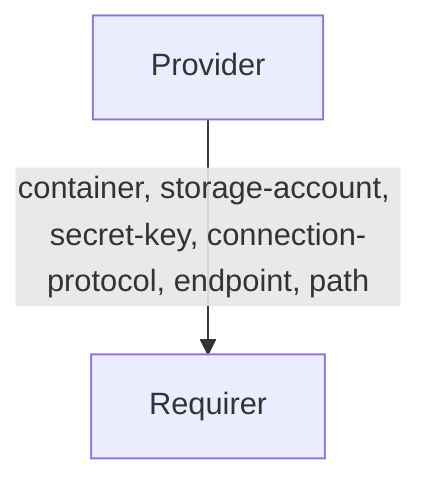

# `azure_storage`

## Usage

This relation interface describes the expected behaviour of any charm claiming to be able to interact with Azure Storage protocol.
This relation interface should be used for both Azure Blob Storage and Azure Data Lake Storage (Gen 2). This interface will be accomplished using the provider library, although charm developers are free to provide alternative libraries as long as they fulfil the behavioural and schematic requirements described in this document.

## Direction



As with all Juju relations, the `azure` interface consists of two parties: a Provider (object storage charm) and a Requirer (application charm). The Provider is expected to generate and share unique credentials (along with `storage-account`, `container`, `connection-protocol` and other fields), which can be used to access the actual object storage.

## Behaviour

Both the Requirer and the Provider must adhere to criteria to be compatible with this interface.

### Provider
- It is expected to provide `storage-account`, `container` and `secret-key` fields corresponding to a storage account, container and the secret key corresponding to an Azure Storage account when a relation joins. As of now, the container is not automatically created when the relation is joined.
- It is expected to provide the `endpoint` field containing a URL (eg, abfss://containername.accountname.dfs.core.windows.net/).
- It is expected to provide the `connection-protocol` field that may be one of `wasb`, `wasbs`, `abfs` or `abfss`; which signifies which connection protocol should be used to connect to the storage account and the container.
- It is expected to provide the optional `path` field that contains the relative path inside the container which is to be used for storage.

### Requirer
- Is expected to provide a container name in the `container` field. Field value should be generated on Requirer side if no particular value set in Requirer juju config.
- Is expected to tolerate that the Provider may ignore the `container` field in some cases (e.g. Azure Storage Integrator) and instead use the container name received.
- Is expected to allow multiple different Juju applications to access the same container name.
- Is expected to have unique credentials for each relation. Therefore, different instances of the same Charm (juju applications) will have different relations with different credentials.
- Is expected to have different relations names on Requirer with the same interface name if Requirer needs access to multiple buckets.

## Relation Data

[\[Pydantic Schema\]](./schema.py)
### Provider


The Provider provides credentials, endpoints, and other parameters necessary to connect to Azure Storage. It should be placed in the **application** databag.


#### Example
```yaml
  application-data:
    container: test-container
    storage-account: test-storage-account
    connection-protocol: abfss
    secret-key: RANDOM
    path: spark-events/
    endpoint: abfss://test-container@test-storage-account.dfs.core.windows.net/
```

### Requirer

[\[JSON Schema\]](./schemas/requirer.json)

Requirer provides container name. Should be placed in the **application** databag in the Requirer.

#### Example

```yaml
  application-data:
    container: test-container
```
