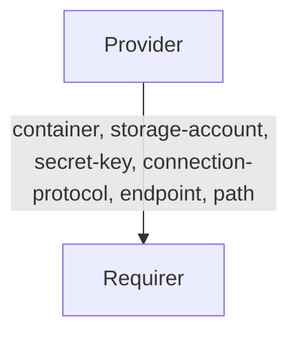

# `azure_storage`

## Usage

This relation interface describes the expected behaviour of any charm claiming to be able to interact with Azure Storage protocol.
This relation interface should be used for both Azure Blob Storage and Azure Data Lake Storage (Gen 2). This interface will be accomplished using the provider library, although charm developers are free to provide alternative libraries as long as they fulfil the behavioural and schematic requirements described in this document.

## Direction



As with all Juju relations, the `azure_storage` interface consists of two parties: a Provider (object storage charm) and a Requirer (application charm). The Provider will be expected to provide new unique credentials (along with `storage-account`, `container`, `connection-protocol` and other fields), which can be used to access the actual object storage.

## Behaviour

Requirer and Provider must adhere to the following criteria to be considered compatible with this interface.

### Provider
The provider is expected to share with requirers all the credentials and configurations as per the schema for a requirer to be able to connect to an Azure Storage container. As of now, the container **may not** be automatically created when the relation is joined.

### Requirer
- Is expected to share the name of the container that is to be used. The provider may ignore the `container` field shared in some cases (e.g. Azure Storage Integrator) and thus the requirer should instead use the container name received in relation data.
- Is expected to allow multiple different Juju applications to access the same container name.
- Is expected to have unique credentials for each relation. Therefore, different instances of the same charm (juju applications) will have different relations with different credentials.
- Is expected to have different relations names on Requirer with the same interface name if Requirer needs access to multiple buckets.

## Relation Data

[\[Pydantic Schema\]](./schema.py)
### Provider


The Provider shares the data necessary to connect to Azure Storage in the **application** databag.


#### Example
```yaml
  application-data:
    container: test-container
    storage-account: test-storage-account
    connection-protocol: abfss
    secret-key: RANDOM
    path: spark-events/
    endpoint: abfss://test-container@test-storage-account.dfs.core.windows.net/
```

### Requirer

[\[JSON Schema\]](./schemas/requirer.json)

Requirer shares the container name in the **application** databag.

#### Example

```yaml
  application-data:
    container: test-container
```
