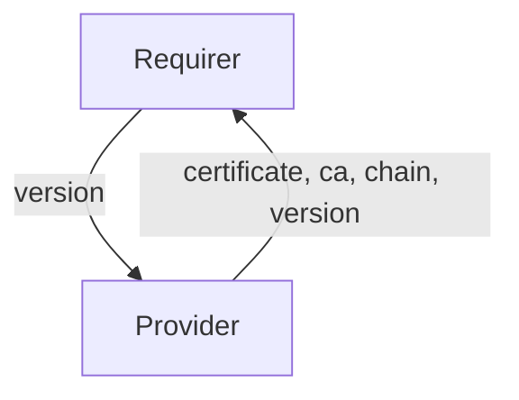

# `certificate_transfer`

## Usage

Some charms require knowledge of public TLS certificates for trusted communication. This relation interface describes the expected behaviour of any charm claiming to be able to authenticate (or be authenticated) through TLS communication.

**Warning**: This relation interface should not be used by charms requiring certificates for themselves. Please use the `tls-certificates` interface for this usecase.

## Direction



As with all Juju relations, the `certificate_transfer` interface consists of two parties: a Provider and a Requirer.

## Behavior

Both the Requirer and the Provider need to adhere to criteria to be considered compatible with the interface.

### Provider

- Is expected to provide a public certificate and/or a CA certificate and/or a CA chain.

### Requirer

- Is expected to use the provided certificate and/or CA certificate and/or chain to authenticate communications.
- Is expected to communicate the used version of the interface, in this case `0`.

## Relation Data

### Provider

[\[JSON Schema\]](./schemas/provider.json)

The provider writes a certificate, CA certificate and CA chain in its unit relation data. In newer patch versions of the library, it also writes the version
of the interface to the databag.

#### Example

```yaml
relation-info:
  - endpoint: certificate_transfer
    related-endpoint: certificate_transfer
    unit-data:
      certificate: "-----BEGIN CERTIFICATE-----\nMIIC6DCCAdCgAwIBAgIUW42TU9LSjEZLMCclWrvSwAsgRtcwDQYJKoZIhvcNAQEL\nBQAwIDELMAkGA1UEBhMCVVMxETAPBgNVBAMMCHdoYXRldmVyMB4XDTIzMDMyNDE4\nNDMxOVoXDTI0MDMyMzE4NDMxOVowPDELMAkGA1UEAwwCb2sxLTArBgNVBC0MJGUw\nNjVmMWI3LTE2OWEtNDE5YS1iNmQyLTc3OWJkOGM4NzIwNjCCASIwDQYJKoZIhvcN\nAQEBBQADggEPADCCAQoCggEBAK42ixoklDH5K5i1NxXo/AFACDa956pE5RA57wlC\nBfgUYaIDRmv7TUVJh6zoMZSD6wjSZl3QgP7UTTZeHbvs3QE9HUwEkH1Lo3a8vD3z\neqsE2vSnOkpWWnPbfxiQyrTm77/LAWBt7lRLRLdfL6WcucD3wsGqm58sWXM3HG0f\nSN7PHCZUFqU6MpkHw8DiKmht5hBgWG+Vq3Zw8MNaqpwb/NgST3yYdcZwb58G2FTS\nZvDSdUfRmD/mY7TpciYV8EFylXNNFkth8oGNLunR9adgZ+9IunfRKj1a7S5GSwXU\nAZDaojw+8k5i3ikztsWH11wAVCiLj/3euIqq95z8xGycnKcCAwEAATANBgkqhkiG\n9w0BAQsFAAOCAQEAWMvcaozgBrZ/MAxzTJmp5gZyLxmMNV6iT9dcqbwzDtDtBvA/\n46ux6ytAQ+A7Bd3AubvozwCr1Id6g66ae0blWYRRZmF8fDdX/SBjIUkv7u9A3NVQ\nXN9gsEvK9pdpfN4ZiflfGSLdhM1STHycLmhG6H5s7HklbukMRhQi+ejbSzm/wiw1\nipcxuKhSUIVNkTLusN5b+HE2gwF1fn0K0z5jWABy08huLgbaEKXJEx5/FKLZGJga\nfpIzAdf25kMTu3gggseaAmzyX3AtT1i8A8nqYfe8fnnVMkvud89kq5jErv/hlMC9\n49g5yWQR2jilYYM3j9BHDuB+Rs+YS5BCep1JnQ==\n-----END CERTIFICATE-----\n"
      ca: "-----BEGIN CERTIFICATE-----\nMIIC6DCCAdCgAwIBAgIUdiBwE/CtaBXJl3MArjZen6Y8kigwDQYJKoZIhvcNAQEL\nBQAwIDELMAkGA1UEBhMCVVMxETAPBgNVBAMMCHdoYXRldmVyMB4XDTIzMDMyNDE4\nNDg1OVoXDTI0MDMyMzE4NDg1OVowPDELMAkGA1UEAwwCb2sxLTArBgNVBC0MJDEw\nMDdjNDBhLWUwYzMtNDVlOS05YTAxLTVlYjY0NWQ0ZmEyZDCCASIwDQYJKoZIhvcN\nAQEBBQADggEPADCCAQoCggEBANOnUl6JDlXpLMRr/PxgtfE/E5Yk6E/TkPkPL/Kk\ntUGjEi42XZDg9zn3U6cjTDYu+rfKY2jiitfsduW6DQIkEpz3AvbuCMbbgnFpcjsB\nYysLSMTmuz/AVPrfnea/tQTALcONCSy1VhAjGSr81ZRSMB4khl9StSauZrbkpJ1P\nshqkFSUyAi31mKrnXz0Es/v0Yi0FzAlgWrZ4u1Ld+Bo2Xz7oK4mHf7/93Jc+tEaM\nIqG6ocD0q8bjPp0tlSxftVADNUzWlZfM6fue5EXzOsKqyDrxYOSchfU9dNzKsaBX\nkxbHEeSUPJeYYj7aVPEfAs/tlUGsoXQvwWfRie8grp2BoLECAwEAATANBgkqhkiG\n9w0BAQsFAAOCAQEACZARBpHYH6Gr2a1ka0mCWfBmOZqfDVan9rsI5TCThoylmaXW\nquEiZ2LObI+5faPzxSBhr9TjJlQamsd4ywout7pHKN8ZGqrCMRJ1jJbUfobu1n2k\nUOsY4+jzV1IRBXJzj64fLal4QhUNv341lAer6Vz3cAyRk7CK89b/DEY0x+jVpyZT\n1osx9JtsOmkDTgvdStGzq5kPKWOfjwHkmKQaZXliCgqbhzcCERppp1s/sX6K7nIh\n4lWiEmzUSD3Hngk51KGWlpZszO5KQ4cSZ3HUt/prg+tt0ROC3pY61k+m5dDUa9M8\nRtMI6iTjzSj/UV8DiAx0yeM+bKoy4jGeXmaL3g==\n-----END CERTIFICATE-----\n"
      chain: [
        "-----BEGIN CERTIFICATE-----\nMIIC6DCCAdCgAwIBAgIUW42TU9LSjEZLMCclWrvSwAsgRtcwDQYJKoZIhvcNAQEL\nBQAwIDELMAkGA1UEBhMCVVMxETAPBgNVBAMMCHdoYXRldmVyMB4XDTIzMDMyNDE4\nNDMxOVoXDTI0MDMyMzE4NDMxOVowPDELMAkGA1UEAwwCb2sxLTArBgNVBC0MJGUw\nNjVmMWI3LTE2OWEtNDE5YS1iNmQyLTc3OWJkOGM4NzIwNjCCASIwDQYJKoZIhvcN\nAQEBBQADggEPADCCAQoCggEBAK42ixoklDH5K5i1NxXo/AFACDa956pE5RA57wlC\nBfgUYaIDRmv7TUVJh6zoMZSD6wjSZl3QgP7UTTZeHbvs3QE9HUwEkH1Lo3a8vD3z\neqsE2vSnOkpWWnPbfxiQyrTm77/LAWBt7lRLRLdfL6WcucD3wsGqm58sWXM3HG0f\nSN7PHCZUFqU6MpkHw8DiKmht5hBgWG+Vq3Zw8MNaqpwb/NgST3yYdcZwb58G2FTS\nZvDSdUfRmD/mY7TpciYV8EFylXNNFkth8oGNLunR9adgZ+9IunfRKj1a7S5GSwXU\nAZDaojw+8k5i3ikztsWH11wAVCiLj/3euIqq95z8xGycnKcCAwEAATANBgkqhkiG\n9w0BAQsFAAOCAQEAWMvcaozgBrZ/MAxzTJmp5gZyLxmMNV6iT9dcqbwzDtDtBvA/\n46ux6ytAQ+A7Bd3AubvozwCr1Id6g66ae0blWYRRZmF8fDdX/SBjIUkv7u9A3NVQ\nXN9gsEvK9pdpfN4ZiflfGSLdhM1STHycLmhG6H5s7HklbukMRhQi+ejbSzm/wiw1\nipcxuKhSUIVNkTLusN5b+HE2gwF1fn0K0z5jWABy08huLgbaEKXJEx5/FKLZGJga\nfpIzAdf25kMTu3gggseaAmzyX3AtT1i8A8nqYfe8fnnVMkvud89kq5jErv/hlMC9\n49g5yWQR2jilYYM3j9BHDuB+Rs+YS5BCep1JnQ==\n-----END CERTIFICATE-----\n",
        "-----BEGIN CERTIFICATE-----\nMIIC6DCCAdCgAwIBAgIUdiBwE/CtaBXJl3MArjZen6Y8kigwDQYJKoZIhvcNAQEL\nBQAwIDELMAkGA1UEBhMCVVMxETAPBgNVBAMMCHdoYXRldmVyMB4XDTIzMDMyNDE4\nNDg1OVoXDTI0MDMyMzE4NDg1OVowPDELMAkGA1UEAwwCb2sxLTArBgNVBC0MJDEw\nMDdjNDBhLWUwYzMtNDVlOS05YTAxLTVlYjY0NWQ0ZmEyZDCCASIwDQYJKoZIhvcN\nAQEBBQADggEPADCCAQoCggEBANOnUl6JDlXpLMRr/PxgtfE/E5Yk6E/TkPkPL/Kk\ntUGjEi42XZDg9zn3U6cjTDYu+rfKY2jiitfsduW6DQIkEpz3AvbuCMbbgnFpcjsB\nYysLSMTmuz/AVPrfnea/tQTALcONCSy1VhAjGSr81ZRSMB4khl9StSauZrbkpJ1P\nshqkFSUyAi31mKrnXz0Es/v0Yi0FzAlgWrZ4u1Ld+Bo2Xz7oK4mHf7/93Jc+tEaM\nIqG6ocD0q8bjPp0tlSxftVADNUzWlZfM6fue5EXzOsKqyDrxYOSchfU9dNzKsaBX\nkxbHEeSUPJeYYj7aVPEfAs/tlUGsoXQvwWfRie8grp2BoLECAwEAATANBgkqhkiG\n9w0BAQsFAAOCAQEACZARBpHYH6Gr2a1ka0mCWfBmOZqfDVan9rsI5TCThoylmaXW\nquEiZ2LObI+5faPzxSBhr9TjJlQamsd4ywout7pHKN8ZGqrCMRJ1jJbUfobu1n2k\nUOsY4+jzV1IRBXJzj64fLal4QhUNv341lAer6Vz3cAyRk7CK89b/DEY0x+jVpyZT\n1osx9JtsOmkDTgvdStGzq5kPKWOfjwHkmKQaZXliCgqbhzcCERppp1s/sX6K7nIh\n4lWiEmzUSD3Hngk51KGWlpZszO5KQ4cSZ3HUt/prg+tt0ROC3pY61k+m5dDUa9M8\nRtMI6iTjzSj/UV8DiAx0yeM+bKoy4jGeXmaL3g==\n-----END CERTIFICATE-----\n"
      ]
      version: 0
```

### Requirer

[\[JSON Schema\]](./schemas/requirer.json)

In newer patch versions of the library, the requirer writes the version number of the interface to its application databag as soon as feasible.

For older version, the requirer does not write anything to its databags. The provider must assume version 0 in that case.

#### Example

```yaml
relation-info:
  - endpoint: certificate_transfer
    related-endpoint: certificate_transfer
    app-data:
      version: 0
```
