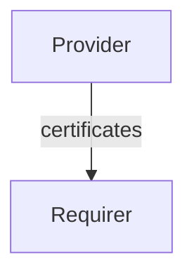

# `certificate_transfer`

## Usage

Some charms require knowledge of public TLS certificates for trusted communication. This relation interface describes the expected behaviour of any charm claiming to be able to authenticate (or be authenticated) through TLS communication.

**Warning**: This relation interface should not be used by charms requiring certificates for themselves. Please use the `tls-certificates` interface for this usecase.

## Direction



As with all Juju relations, the `certificate_transfer` interface consists of two parties: a Provider and a Requirer.

## Behavior

Both the Requirer and the Provider need to adhere to criteria to be considered compatible with the interface.

### Provider

- Is expected to provide a list of public certificates and/or CA certificates.

### Requirer

- Is expected to use the provided certificates and/or CA certificates to authenticate communications.

## Relation Data

### Provider

[\[JSON Schema\]](./schema.py)

The provider writes any number of certficates to its relation data.

#### Example

```yaml
relation-info:
  - endpoint: certificate_transfer
    related-endpoint: certificate_transfer
    app-data:
      certificates:
      - "-----BEGIN CERTIFICATE-----\nMIIC6DCCAdCgAwIBAgIUW42TU9LSjEZLMCclWrvSwAsgRtcwDQYJKoZIhvcNAQEL\nBQAwIDELMAkGA1UEBhMCVVMxETAPBgNVBAMMCHdoYXRldmVyMB4XDTIzMDMyNDE4\nNDMxOVoXDTI0MDMyMzE4NDMxOVowPDELMAkGA1UEAwwCb2sxLTArBgNVBC0MJGUw\nNjVmMWI3LTE2OWEtNDE5YS1iNmQyLTc3OWJkOGM4NzIwNjCCASIwDQYJKoZIhvcN\nAQEBBQADggEPADCCAQoCggEBAK42ixoklDH5K5i1NxXo/AFACDa956pE5RA57wlC\nBfgUYaIDRmv7TUVJh6zoMZSD6wjSZl3QgP7UTTZeHbvs3QE9HUwEkH1Lo3a8vD3z\neqsE2vSnOkpWWnPbfxiQyrTm77/LAWBt7lRLRLdfL6WcucD3wsGqm58sWXM3HG0f\nSN7PHCZUFqU6MpkHw8DiKmht5hBgWG+Vq3Zw8MNaqpwb/NgST3yYdcZwb58G2FTS\nZvDSdUfRmD/mY7TpciYV8EFylXNNFkth8oGNLunR9adgZ+9IunfRKj1a7S5GSwXU\nAZDaojw+8k5i3ikztsWH11wAVCiLj/3euIqq95z8xGycnKcCAwEAATANBgkqhkiG\n9w0BAQsFAAOCAQEAWMvcaozgBrZ/MAxzTJmp5gZyLxmMNV6iT9dcqbwzDtDtBvA/\n46ux6ytAQ+A7Bd3AubvozwCr1Id6g66ae0blWYRRZmF8fDdX/SBjIUkv7u9A3NVQ\nXN9gsEvK9pdpfN4ZiflfGSLdhM1STHycLmhG6H5s7HklbukMRhQi+ejbSzm/wiw1\nipcxuKhSUIVNkTLusN5b+HE2gwF1fn0K0z5jWABy08huLgbaEKXJEx5/FKLZGJga\nfpIzAdf25kMTu3gggseaAmzyX3AtT1i8A8nqYfe8fnnVMkvud89kq5jErv/hlMC9\n49g5yWQR2jilYYM3j9BHDuB+Rs+YS5BCep1JnQ==\n-----END CERTIFICATE-----\n"
      - "-----BEGIN CERTIFICATE-----\nMIIC6DCCAdCgAwIBAgIUW42TU9LSjEZLMCclWrvSwAsgRtcwDQYJKoZIhvcNAQEL\nBQAwIDELMAkGA1UEBhMCVVMxETAPBgNVBAMMCHdoYXRldmVyMB4XDTIzMDMyNDE4\nNDMxOVoXDTI0MDMyMzE4NDMxOVowPDELMAkGA1UEAwwCb2sxLTArBgNVBC0MJGUw\nNjVmMWI3LTE2OWEtNDE5YS1iNmQyLTc3OWJkOGM4NzIwNjCCASIwDQYJKoZIhvcN\nAQEBBQADggEPADCCAQoCggEBAK42ixoklDH5K5i1NxXo/AFACDa956pE5RA57wlC\nBfgUYaIDRmv7TUVJh6zoMZSD6wjSZl3QgP7UTTZeHbvs3QE9HUwEkH1Lo3a8vD3z\neqsE2vSnOkpWWnPbfxiQyrTm77/LAWBt7lRLRLdfL6WcucD3wsGqm58sWXM3HG0f\nSN7PHCZUFqU6MpkHw8DiKmht5hBgWG+Vq3Zw8MNaqpwb/NgST3yYdcZwb58G2FTS\nZvDSdUfRmD/mY7TpciYV8EFylXNNFkth8oGNLunR9adgZ+9IunfRKj1a7S5GSwXU\nAZDaojw+8k5i3ikztsWH11wAVCiLj/3euIqq95z8xGycnKcCAwEAATANBgkqhkiG\n9w0BAQsFAAOCAQEAWMvcaozgBrZ/MAxzTJmp5gZyLxmMNV6iT9dcqbwzDtDtBvA/\n46ux6ytAQ+A7Bd3AubvozwCr1Id6g66ae0blWYRRZmF8fDdX/SBjIUkv7u9A3NVQ\nXN9gsEvK9pdpfN4ZiflfGSLdhM1STHycLmhG6H5s7HklbukMRhQi+ejbSzm/wiw1\nipcxuKhSUIVNkTLusN5b+HE2gwF1fn0K0z5jWABy08huLgbaEKXJEx5/FKLZGJga\nfpIzAdf25kMTu3gggseaAmzyX3AtT1i8A8nqYfe8fnnVMkvud89kq5jErv/hlMC9\n49g5yWQR2jilYYM3j9BHDuB+Rs+YS5BCep1JnQ==\n-----END CERTIFICATE-----\n"
      