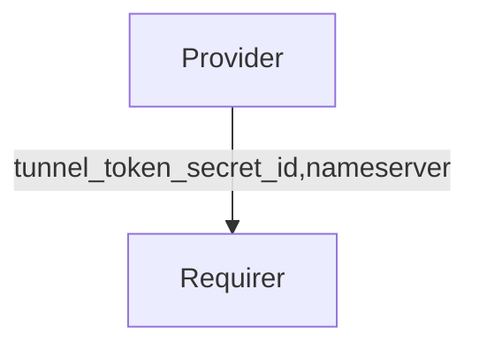

# `cloudflared_route`

## Usage

The `cloudflared_route` interface is designed to facilitate information exchange between the cloudflared tunnel configurator charm and the cloudflared tunnel charm.

## Direction

The `cloudflared_route` interface follows a provider/requirer pattern. The requirer is a charm that runs the cloudflared tunnel, and the provider is the charm that supplies configurations for the cloudflared tunnel.



## Behavior

The following are the criteria that a Provider and Requirer need to adhere to in order to be compatible with this interface.

### Provider

- Is expected to provide a cloudflared tunnel token via a Juju secret.
  - The Juju secret ID should be placed in the integration application databag with the name `tunnel_token_secret_id`.
  - The Juju secret should be readable by the requirer charm.
  - The Juju secret should contain one field, `tunnel-token`, with the cloudflared tunnel token as its content.
- Is expected to update the cloudflared tunnel token either by creating a new Juju secret and replacing the Juju secret ID in `tunnel_token_secret_id`, or by updating the content of the existing Juju secret ID.
- Is expected to optionally include a `nameserver` field in the integration databag.
  - The `nameserver` field must be an IPv4 or IPv6 address of a DNS nameserver.
  - The nameserver provided in this field must listen on port 53.
  - The nameserver provided in this field must be able to resolve public domains.
  - The nameserver provided in this field must be able to resolve any domain configured as the backend service for the cloudflared tunnel.

### Requirer

- Is expected to run a cloudflared tunnel instance with the provided tunnel token.
- Is expected to restart the cloudflared tunnel instance with a new tunnel token if the token changes in the integration.
- Is expected to run the cloudflared tunnel instance using the system's default nameserver if `nameserver` is not provided in the integration.
- Is expected to run the cloudflared tunnel instance with the specified `nameserver` if it is provided in the integration.

## Relation Data

### Provider

[\[JSON Schema\]](./schemas/provider.json)

The Provider provides the result of the requirer's request. It should be placed in the application databag.

#### Example
```json
  {
    "application-data": {
      "tunnel_token_secret_id": "secret:csn5caau557j9bojn7rg",
      "nameserver": "1.1.1.1"
    }
  }
```