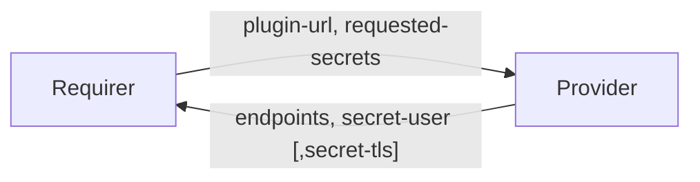

# `connect_client`

## Usage

This relation interface describes the expected behavior of any charm claiming to be able to interface with a Kafka Connect cluster as a client/integrator or a provider. For the sake of this document,  `client`, `integrator` and `requirer` all refer to the same concept.

A Kafka Connect integrator will either require a specific `connector` library (which is a bundle of JAR files adhering to Kafka Connect connector interface definition) or not:

- In case it requires a connector library, it should provide the URL of this resource via `plugin-url` parameter on the requirer side. All the required files should be packaged into a single Tarball and served at the provided endpoint. The only requirement here is that the `plugin-url` should be accessible by the Kafka Connect provider.
- In case a connector library is not required (e.g. the case of MirrorMaker integrator), the requirer should fill the `plugin-url` with the sentinel value: `NOT-REQUIRED`.

This interface is implemented in the [`data_interfaces`](https://charmhub.io/data-platform-libs/libraries/data_interfaces) library of the `data_platform_libs`. Moreover, requirer charms can use the [`kafkacl`](https://github.com/canonical/kafkacl) library which provides reusable code for Kafka Connect integrator charms. Developers are free to provide alternative libraries as long as they fulfil the behavioural and schematic requirements described in this document.

## Direction



## Behavior

Both the Requirer and the Provider need to adhere to the following criteria, to be considered compatible with the interface.

### Provider

- The provider should download the connector plugins from the `plugin-url` path provided by the requirer and make it available across all Kafka Connect workers. In case it encounters the sentinel value `NOT-REQUIRED`, it should skip this step.
- Is expected to create an application `username` and `password` inside the Kafka Connect cluster after making sure the connector plugins are available on all workers.
- Is expected to put the credentials (`username` and `password`) , which could be used on the Kafka Connect REST interface by the requirer, in a Juju Secret and expose the Juju Secrets URI through the `secret-user` field of the data bag.
- Is expected to provide the `endpoints` field with a comma-seperated list of Kafka Connect REST endpoints. Each value in this list also includes the protocol which could be `http` or `https`.
- If using HTTPS for REST endpoints, is expected to provide the CA chain in the `tls-ca` field of a Juju Secret and share the TLS Juju Secret URI through the `secret-tls` field of the databag.
- Is expected to delete an application `username` and `password` from the Kafka Connect cluster when the relation is removed.
- Is expected to cleanup all client plugin files when the relation is removed.

### Requirer

- Is expected to provide the `plugin-url` field specifying the URL at which the connector plugin files are served as a single Tarball, or the sentinel value `NOT-REQUIRED` in case it does not need a plugin.
- Is expected to provide `requested-secrets`, which is a list  of field names that are not to be exposed on the relation databag, but  handled within Juju Secrets. It should be a JSON parsable array of  strings, and correspond to valid Juju Secret keys (i.e. alphanumerical  characters with a potential '-' (dash) character). Secret fields must  contain `username` and `password` (and `tls-ca` in case TLS is enabled).
- Is expected to manage its own connector/task(s) lifecycle by the means of Kafka Connect REST endpoints, using the data provided by the provider.

## Relation Data

### Provider

[\[JSON Schema\]](./schemas/provider.json)

Provider provides credentials and REST endpoint uris. It should be placed in the **application** databag.

#### Example

```yaml
relation-info:
  - endpoint: connect_client
    related-endpoint: connect_client
    application-data:
      endpoints: http://10.1.1.100:8083,http://10.1.1.101:8083,http://10.1.1.102:8083
      secret-user: secret://59060ecc-0495-4a80-8006-5f1fc13fd783/cjqub6vubg2s77p3nio0
      secret-tls: secret://59060ecc-0495-4a80-8006-5f1fc13fd783/cjqub7fubg2s77p3niog
```

### Requirer

[\[JSON Schema\]](./schemas/requirer.json)

Requirer provides (and possibly serves) the `plugin-url`. It should be placed in the **application** databag.

#### Example

```yaml
relation-info:
  - endpoint: connect_client
    related-endpoint: connect_client
    application-data:
      plugin-url: http://10.1.1.200:8080/route/to/plugin
      requested-secrets: ["username", "password", "tls-ca"]
```
