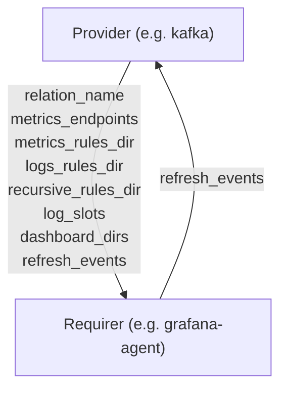

# `cos_agent`

## Usage

The `cos_agent` interface is meant to exchange information on several observability-related data streams at once. This is a `SUBORDINATE`, ergo MACHINE-charm-specific relation interface.


## Direction



As all Juju relations, the `cos_agent` interface consists of a provider and a requirer. In this case the `Provider` side of the relationship may provide telemetry settings, if not, the required side will use default values.

## Behavior

### Provider

- Is expected to be able to provide metrics endpoints to be scraped.
- Is expected to be able to provide a directory containing Prometheus style metrics rules files.
- Is expected to be able to provide a directory containing Loki style rules files.
- Is expected to be able to inform if metrics and logs rules directories should be scanned recursively.
- Is expected to be able to provide snap slots to connect to for scraping logs.
- Is expected to be able to provide a list of directories containing Grafana dashboard files.
- Is expected to be able to provide a list of events on which to refresh relation data.


## Relation Data

### Provider

[\[JSON Schema\]]


#### Unit data
- Exposes mtrics_alert_rules, log_alert_rules, and log_slots

#### Example


```json
{
  "config": {
    "metrics_alert_rules": {
      "groups": [
        {
          "name": "test_58b48ff0_zookeeper_cos_23790144_zinc",
          "rules": [
            {
              "alert": "ZincTargetMissing",
              "annotations": {
                "description": "A Prometheus target has disappeared. An exporter might be crashed.\n  VALUE = {{ $value }}\n  LABELS = {{ $labels }}",
                "summary": "Prometheus target missing (instance {{ $labels.instance}})"
              },
              "expr": "up{juju_application=\"zinc2\"} == 0",
              "for": "0m",
              "labels": {
                "app_group": "cloud",
                "juju_application": "zookeeper",
                "juju_charm": "zookeeper",
                "juju_model": "test",
                "juju_model_uuid": "58b48ff0-608b-435f-83b9-ea643e0b98db",
                "severity": "critical"
              }
            }
          ]
        }
      ]
    },
    "log_alert_rules": {},
    /* Dashboards list with base64 encoded, lzma-compressed, json-dumped dashboard data */
    "dashboards": [
      "/Td6WFoAAATm1rRGAgAhARYAAAB0L+Wj6hvVPXVdA…",
      "/Td6WFoAAATm1rRGAgAhARYAAAB0L+Wj6hvVPXVdB…"
    ],
    "log_slots": [
      "charmed-zookeeper:logs"
    ],
    "metrics_scrape_jobs": [{"job_name": "kafka_0", "path": "/metrics", "port": 9101}],
  }
}
```
