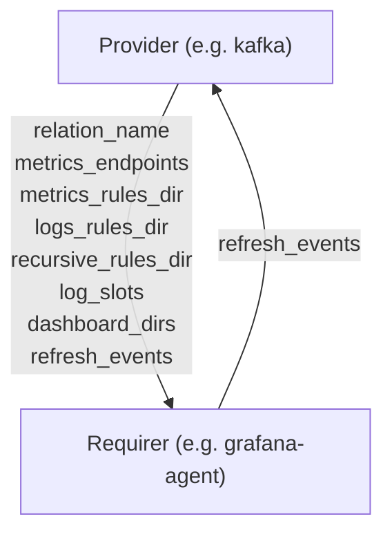

# `cos_agent`

## Usage

The `cos_agent` interface is meant to exchange information on several observability-related data streams at once.

The first implementation was for the [`grafana-agent`](https://charmhub.io/grafana-agent/libraries/cos_agent) machine charm for "converting" paths to log files, alert rules and dashboards into relation data for the `loki_push_api`, `prometheus_remote_write` and `grafana_dashboards` interfaces.


## Direction



As all Juju relations, the `cos_agent` interface consists of a provider and a requirer. In this case the `Provider` side of the relationship may provide telemetry settings, if not, the required side will use default values.

## Behavior

### Provider

- Is expected to be able to provide metrics endpoints to be scraped.
- Is expected to be able to provide a directory containing Prometheus style metrics rules files.
- Is expected to be able to provide a directory containing Loki style rules files.
- Is expected to be able to inform if metrics and logs rules directories should be scanned recursively.
- Is expected to be able to provide snap slots to connect to for scraping logs.
- Is expected to be able to provide a list of directories containing Grafana dashboard files.
- Is expected to be able to provide a list of events on which to refresh relation data.


### Requirer
- Is expected to be able to scrape Prometheus metrics from metrics endpoints and remote-write these metrics to Prometheus and Prometheus compatible systems.
- Is expected to be able to forward alert rules exposed over the relation data bag to Prometheus.
- Is expected to be able to forward logs from the Provider to Loki.
- Is expected to be able to forward alert rules exposed over the relation data bag to Loki.
- Is expected to be able to forward Grafana Dashboards exposed over the relation data bag to Grafana.


## Relation Data

### Provider

[\[JSON Schema\]](./schemas/provider.json)

#### Application data
- Exposes all scrape jobs the requirer should scrape metrics through. Should be placed in the **application** databag.


#### Unit data
- Exposes the unit address of each unit to scrape, as well as the unit name of each address. Should be placed in the **unit** databag of each scrapable unit.

#### Example


```json
application-data:
  alert_rules: {
    "groups": [
      {
        "name": "an_alert_rule_group",
        "rules": [
          {
            "alert": "SomethingIsUp",
            "expr": "something_bad == 1",
            "for": "0m",
            "labels": {
              "some-label": "some-value"
            },
            "annotations": {
              "some-annotation": "some-other-value"
            }
          }
        ]
      }
    ]
  }
  scrape_jobs: [
    {
      "metrics_path": "/metrics",
      "static_configs": [
        { "targets": ["*:4080"] }
      ]
    }
  ]
  scrape_metadata: {
    "model": "cos",
    "model_uuid": "c2e9f4d5-dcb3-4870-8509-330eb9745ee8",
    "application": "zinc-k8s",
    "unit": "zinc-k8s/0",
    "charm_name": "zinc-k8s"
  }
related-units:
  zinc-k8s/0:
    data:
      prometheus_scrape_unit_address: zinc-k8s-0.zinc-k8s-endpoints.cos.svc.cluster.local
      prometheus_scrape_unit_name: zinc-k8s/0
      # ...
    # ...
  zinc-k8s/1:
    data:
      prometheus_scrape_unit_address: zinc-k8s-1.zinc-k8s-endpoints.cos.svc.cluster.local
      prometheus_scrape_unit_name: zinc-k8s/1
      # ...
    # ...
```

### Requirer

None.
