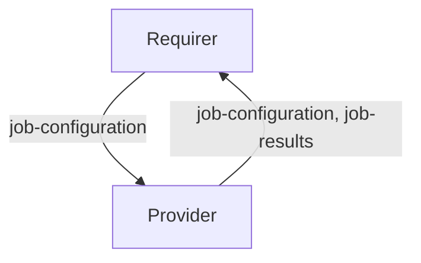

# `database_backup`

## Usage

This relation interface describes how a database backup manager charm would interact with a database charm. A database backup manager will enable a juju admin to:

1. backup the state of a related database to a specified storage
1. restore the state of a related data from a specified backup in storage

Initially, the backup or restore will be triggered manually against the database backup manager via an action. However, eventually, the juju admin will be able to schedule periodic backups on the database backup manager.

## Direction



The interface consists of two parties: a Provider (database charm) and a Requirer (database backup manager charm). The Requirer will be expected to request the relevant jobs (backups or restores) to execute. The provider will then be expected to execute these jobs and respond with their statuses.

## Behavior

The following is the criteria that a Provider and Requirer need to adhere to be compatible with this interface.

### Provider

- Is expected to detect any new jobs and run either a backup or restore based on the `job-type`.
- Is expected to run concurrent backups if possible (e.g. incremental/PITR backup in some cases can be parallel to full backup), but only one restore at a time.
- Is expected to have appropriate locking mechanisms to avoid running incompatible jobs concurrently (e.g. a backup and a restore).
- Is expected to indicate to the Requirer the status of the current or most recently completed job via the `status` field.
- Is expected, in the case of backups, to upload backup and log artefacts to the provided storage.
- Is expected, in the case of restores, to retrieve backup artefacts from the provided storage.

### Requirer

- Is expected to provide the appropriate storage configurations for each job.
- Is expected to relay the results of completed jobs back to the Juju admin.
- Is expected to preserve the history of completed and running jobs, but also provide a mechanism to clear the history of completed jobs.

## Relation Data

### Provider

[\[JSON Schema\]](./schemas/provider.json)

Provider (database charm) is expected to record the status of running or completed jobs in the **unit** databag of the unit that performed the job.

#### Example
```yaml
  relation-info:
  - endpoint: database-backup
    related-endpoint: database-backup
    applcation-data: {}
    related-units:
      mysql/0:
        in-scope: true
        data:
          jobs: '
            [
              {
                "job-id": "another-unique-job-id",
                "job-type": "restore",
                "job-config": {
                  "compression": true
                },
                "storage-interface": "s3",
                "storage-config": {
                  "bucket": "my-bucket",
                  "access-key": "access-key",
                  "secret-key": "secret-key"
                },
                "status": "error",
                "message": "MySQL charm in blocked state"
              }
            ]
          '
      mysql/1:
        in-scope: true
        data:
          jobs: '
            [
              {
                "job-id": "unique-job-id",
                "job-type": "backup",
                "job-config": {
                  "compression": false
                },
                "storage-interface": "s3",
                "storage-config": {
                  "bucket": "my-bucket",
                  "access-key": "access-key",
                  "secret-key": "secret-key"
                },
                "status": "success",
                "artefact-path": "/path/to/backups-and-logs/"
              }
            ]
          '
```

### Requirer

[\[JSON Schema\]](./schemas/requirer.json)

Requirer (database backup manager charm) is expected to request jobs by placing them in the **application** databag.

#### Example

```yaml
  relation-info:
  - endpoint: database-backup
    related-endpoint: database-backup
    application-data:
      jobs: '
        [
          {
            "job-id": "unique-job-id",
            "job-type": "backup",
            "job-config": {
              "compression": true,
            }
            "storage-interface": "s3",
            "storage-config": {
              "bucket": "my-bucket",
              "access-key": "access-key",
              "secret-key": "secret-key"
            }
          },
          {
            "job-id": "another-unique-job-id",
            "job-type": "restore",
            "job-config": {
              "compression": true
            },
            "storage-interface": "s3",
            "storage-config": {
              "bucket": "my-bucket",
              "access-key": "access-key",
              "secret-key": "secret-key"
            },
            "artefact-path": "/path/to/retrieve/backups/"
          }
        ]
      '
```
