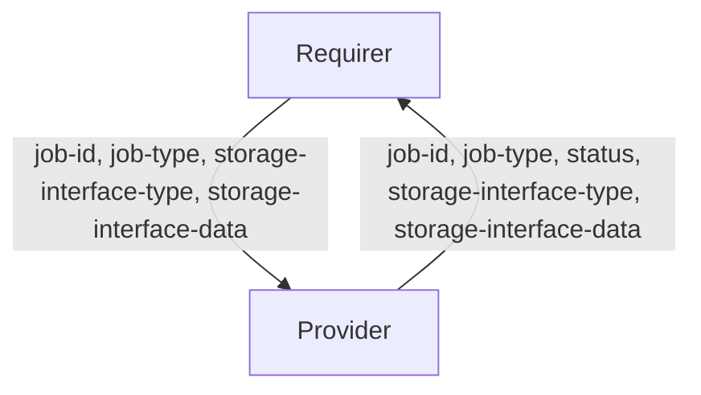

# `database_backup_manager`

## Usage

This relation interface describes how a database backup manager charm would interact with a database charm. A database backup manager will enable a juju admin to:

1. backup the state of a related database to a specified storage
1. restore the state of a related data from a specified backup in storage

Initially, the backup or restore will be triggered manually against the database backup manager via an action. However, eventually, the juju admin will be able to schedule periodic backups on the database backup manager.

## Direction



The interface consists of two parties: a Provider (database charm) and a Requirer (database manager charm). The Requirer will be expected to provide the relevant job details, and storage interface type and data. The provider will in turn respond with the same job details, along with the `status` of the job after it has completed (either successfully or unsucessfully). The log and backup files will be stored in the location provided in the storage interface data.

## Behavior

The following is the criteria that a Provider and Requirer need to adhere to be compatible with this interface.

### Provider

- Is expected to detect a change in `job-id` and run either a backup or restore based on the `job-type`.
- Is expected to only run a job when it is idle. Any job further requests after a backup/restore is started may be ignored.
- Is expected to have a locking mechanism to avoid running multiple jobs at once.
- Is expected to indicate to the Requirer the status of the current or most recently completed job via the `status` field.
- Is expected to upload the log file for the job to the `s3-log-file` in the `storage-interface-data`.
- Is expected to upload the backup file to the `s3-backup-file` in the `storage-interface-data` if it was successful in backing up the database.
- Is expected to retrieve the backup file from the `s3-restore-file` in the `storage-interface-data` if it was required to restore a backup.
- Is expected to return all valid `storage-interface-data` fields as a reference for future jobs.

### Requirer

- Is expected to provide a unique `job-id` and `job-type` (backup or restore).
- Is expected to pass in the `storage-interface-type` and `storage-interface-data` (`s3-bucket`, `s3-access-key`, `s3-secret-key`, `s3-log-file`, `s3-backup-file` and `s3-restore-file`) needed to either store or retrieve the backup file.
- Is expected to wait until the Provider returns a `status` of the job to relay the results to the Juju admin.

## Relation Data

### Provider

[\[JSON Schema\]](./schemas/provider.json)

Provider provides information about the job (`job-id`, `job-type` and `status`). In the case of a backup, this information will be placed in the **unit** databag of the unit that performed the backup. In the case of a restore, this information will be place in the **unit** databag of the lowest numbered unit (where the restore is performed).

#### Example
```yaml
  relation-info:
  - endpoint: database-backup-manager
    related-endpoint: database-backup-manager
    applcation-data: {}
    related-units:
      mysql/0:
        in-scope: true
        data:
          job-id: unique-job-id
          job-type: backup
          status: success
          storage-interface-type: s3
          storage-interface-data:
            s3-access-key: access-key
            s3-secret-key: secret-key
            s3-log-file: s3://bucket/mysql/2022-01-01T01:01:01.123456/logs/backup.log
            s3-backup-file: s3://bucket/mysql/2022-01-01T01:01:01.123456/backups/mysql.backup
```

```yaml
  relation-info:
  - endpoint: database-backup-manager
    related-endpoint: database-backup-manager
    application-data: {}
    related-units:
      mysql/0:
        in-scope: true
        data:
          job-id: unique-job-id
          job-type: restore
          status: success
          storage-interface-type: s3
          storage-interface-data:
            s3-access-key: access-key
            s3-secret-key: secret-key
            s3-log-file: s3://bucket/mysql/2022-01-01T01:01:01.123456/logs/restore.log
            s3-restore-file: s3://bucket/mysql/2021-01-01T01:01:01.123456/backups/mysql.backup
```

### Requirer

[\[JSON Schema\]](./schemas/requirer.json)

Requirer provides the job information (`job-id`, `job-type`), `storage-interface-type` and the relevant `storage-interface-data` (`s3-bucket`, `s3-access-key`, `s3-secret-key`, `s3-log-file`, `s3-backup-file` and `s3-restore-file`) in the **application** databag of the Requirer.

#### Example

```yaml
  relation-info:
  - endpoint: database-backup-manager
    related-endpoint: database-backup-manager
    application-data:
      job-id: unique-job-id
      job-type: backup
      storage-interface-type: s3
      storage-interface-data:
        s3-access-key: access-key
        s3-secret-key: secret-key
        s3-log-file: s3://bucket/mysql/2022-01-01T01:01:01.123456/logs/backup.log
        s3-backup-file: s3://bucket/mysql/2022-01-01T01:01:01.123456/backups/mysql.backup
```

```yaml
  relation-info:
  - endpoint: database-backup-manager
    related-endpoint: database-backup-manager
    application-data:
      job-id: unique-job-id
      job-type: restore
      storage-interface-type: s3
      storage-interface-data:
        s3-access-key: access-key
        s3-secret-key: secret-key
        s3-log-file: s3://bucket/mysql/2022-01-01T01:01:01.123456/logs/restore.log
        s3-restore-file: s3://bucket/mysql/2021-01-01T01:01:01.123456/backups/mysql.backup
```
