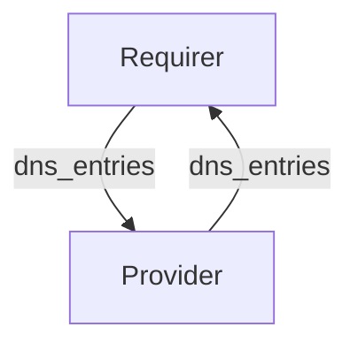

# `dns_record`

## Usage

This relation interface describes the expected behavior of any charm claiming to be able to interface with a DNS record Provider.

## Direction

The `dns_record` interface implements a provider/requirer pattern. The requirer is a charm that wishes to create a set of DNS records, and the provider is the charm managing those.


## Behavior

The following is the criteria that a Provider and Requirer need to adhere to be compatible with this interface.

### Provider

- Is expected to provide a list of dns_entries in the relation databag, each containing the domain, the status and optionally the description corresponding to the dns_entries requirested by the requirer.

### Requirer

- Is expected to provide a list of dns_entries mains in the relation databag, containing at least the dns-domain, the host-label and record-data. The dns-domain must be present in the list of dns_domains for authentication.


## Relation Data

### Provider

[\[JSON Schema\]](./schemas/provider.json)

Provider provides the result of the requirer request. It should be placed in the application databag.

#### Example
```json
  "application-data": {
    "dns_entries": [
      {
        "uuid": "550e8400-e29b-41d4-a716-446655440002",
        "status": "invalid_credentials",
        "description": "invalid_credentials"
      },
      {
        "uuid": "550e8400-e29b-41d4-a716-446655440003",
        "status": "approved"
      }
    ]
  }

```

### Requirer

[\[JSON Schema\]](./schemas/requirer.json)

Requirer request the details of one or more DNS records. It should be placed in the application databag.

#### Example

```json
  "application-data": {
    "dns_entries": [
      {
        "uuid": "550e8400-e29b-41d4-a716-446655440002",
        "domain": "cloud.canonical.com",
        "host_label": "admin",
        "ttl": 600,
        "record_class": "IN",
        "record_type": "A",
        "record_data": "91.189.91.48"
      },
      {
        "uuid": "550e8400-e29b-41d4-a716-446655440003",
        "domain": "staging.canonical.com",
        "host_label": "www",
        "record_data": "91.189.91.47"
      }
    ]
  }
```
