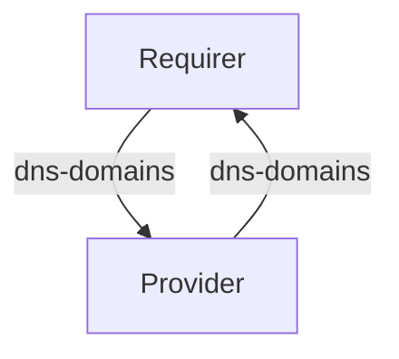

# `dns_record`

## Usage

This relation interface describes the expected behavior of any charm claiming to be able to interface with a DNS record Provider.

## Direction

The `dns_record` interface implements a provider/requirer pattern. The requirer is a charm that wishes to create a set of DNS records, and the provider is a the charm managing those..


## Behavior

The following is the criteria that a Provider and Requirer need to adhere to be compatible with this interface.

### Provider

- Is expected to provide a list of dns-domains in the relation databag, each containing the domain, the status and optionally the status_description.

### Requirer

- Is expected to provide a list of dns-domains in the relation databag, each containing the domain it is requesting a DNS record for, the username and the password containing a juju secret to authenticate the request.

## Relation Data

### Provider

[\[JSON Schema\]](./schemas/provider.json)

Provider provides the result of the requirer request. It should be placed in the application databag.

#### Example
```yaml
  application-data:
    dns-domains: ‘[
      {
        "domain": "cloud.canonical.com",
        "status": "denied",
        "status_description": "incorrect username & password"
      },
      {
        "domain": "staging.ubuntu.com",
        "status": "approved"
      }
    ]’

```

### Requirer

[\[JSON Schema\]](./schemas/requirer.json)

Requirer request the details of one or more DNS records. It should be placed in the application databag.

#### Example

```yaml
  application-data:
    dns-domains: ‘[
      {
        "domain": "cloud.canonical.com",
        "username": "user1",
        "password": "password1 (as juju secret)"
      },
      {
        "domain": "staging.ubuntu.com",
        "username": "user2",
        "password": "password2 (as juju secret)"
      }
    ]’
```
