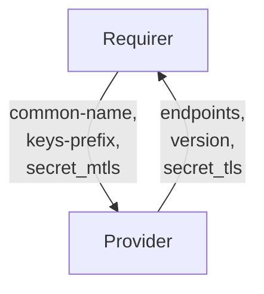

# `etcd_-_client`

## Usage

This relation interface describes the expected behaviour of any charm interfacing with etcd [Charmed etcd Operator](https://github.com/canonical/charmed-etcd-operator) using the `etcd-client` relation.  

In most cases, this will be accomplished using the [data_interfaces library](https://github.com/canonical/data-platform-libs/blob/main/lib/charms/data_platform_libs/v0/data_interfaces.py), although charm developers are free to provide alternative libraries as long as they fulfil the behavioural and schematic requirements described in this document.

## Direction

If this interface implements a provider/requirer pattern, describe the directionality of the relation and its meaning.
It would be good to have a mermaid chart to explain further:


```mermaid
flowchart TD
    Requirer -- common-name, \nkeys-prefix, \nsecret_mtls --> Provider
    Provider -- endpoints, \nversion, \nsecret_tls --> Requirer
```

As with all Juju relations, the `etcd-client` interface consists of two parties: a Provider (etcd charm), and a Requirer (application charm). The Requirer will be expected to provide its common name to be used as a username, the range of keys accessed, and the CA used to sign its certificate. The Provider will provide the endpoints the client can use to access the database, the CA that issues the server certificate, and the etcd api version supported.


## Behavior

Both the Requirer and the Provider need to adhere to criteria to be considered compatible with the interface.

If both sides support Juju Secrets, sensitive information is transmitted through Juju Secrets rather than directly through the relation data bag(s). Corresponding pieces of information are grouped together in a single secret.
If any side, Provider or Requirer doesn't support Juju Secrets, sensitive information is transmitted through the relational data bag in the same fields as in Juju Secret.

### Provider

- Is expected to provide `requested-secrets`, which is a list of field names that are not to be exposed on the relation databag, but handled within Juju Secrets. It should be JSON parsable array of strings, and correspond to valid Juju Secret keys (i.e. alphanumerical characters with a potential '-' (dash) character). Secret fields must contain `client-chain`.
- Is expected to provide the `endpoints` field containing all cluster endpoint addresses in a comma-separated list.
- Is expected to provide the `version` field describing the installed version number of etcd.
- Is expected to provide the CA chain in the `tls-ca` field of a Juju Secret.
- Is expected to share the TLS Juju Secret URI through the `secret-tls` field of the databag.
- Is expected to create a user with the common name provided by the Requirer.
- Is expected to create a role with read and write permissions for the keys prefix provided by the Requirer.
- Is expected to grant the user the role created.
- Is expected to delete the user and role when the relation is removed.
- Is expected to add the `ca-chain` provided by the Requirer to the trusted client CA list.
- Is expected to perform a rolling restart of the etcd cluster to reload the client CA list.
- Is expected to update the trusted client CA list and perform a rolling restart when the relation is updated and the `ca-chain` changes.
- Is expected to delete the `ca-chain` from the trusted client CA list when the relation is removed.

### Requirer
- Is expected to provide `requested-secrets`, which is a list of field names that are not to be exposed on the relation databag, but handled within Juju Secrets. It should be JSON parsable array of strings, and correspond to valid Juju Secret keys (i.e. alphanumerical characters with a potential '-' (dash) character). Secret fields must contain `tls-ca`.
- Is expected to provide the `common-name` field containing the common name to be used as the username.
- Is expected to provide the `prefix` field containing the range of keys accessed by the client.
- Is expected to provide the client CA chain in the `client-chain` field of a Juju Secret.
- Is expected to share the client CA Juju Secret URI through the `secret-mtls` field of the databag.

## Relation Data

Describe the contents of the databags, and provide schemas for them.

[\[Pydantic Schema\]](./schema.py)

#### Example
Provide a yaml/json example of a valid databag state (for the whole relation).
```yaml
provider:
  application-data:
      endpoints: https://10.73.32.13:2379,https://10.73.32.136:2379,https://10.73.32.238:2379
      secret-tls: secret://9d39bbbe-d95a-405d-8573-6835864daf92/cuvbv6p34trs48a10a2g
      version: 3.5.18
      requested-secrets: '["client-chain"]'
requirer:
  application-data:
      common-name: requirer-charm
      prefix: /test/
      secret-mtls: secret://9d39bbbe-d95a-405d-8573-6835864daf92/1a2b3c4d5e6f7g8h9i0j
      requested-secrets: '["tls-ca"]'
```
