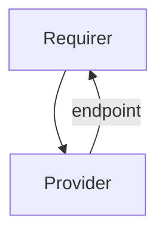

# `filesystem_info`

## Usage

This interface defines how a charm that exports a shared filesystem can expose the required mount information
to a client charm that wants to mount the filesystem.

## Direction

The `filesystem_info` interface implements a provider/requirer pattern. The Requirer is a charm that wishes to
mount a shared filesystem, and the Provider is the charm exporting the mount information to do that.



## Behavior

The exported endpoint from the Provider needs to adhere to a sublanguage of the URI grammar, which is specified
by [RFC 3986](https://datatracker.ietf.org/doc/html/rfc3986#appendix-A). The specific sublanguage is defined
by the following grammar in Augmented Backus–Naur form:

```
key = 1*( unreserved )
value = 1*( unreserved / ":" / "/" / "?" / "#" / "[" / "]" / "@" / "!" / "$"
      / "'" / "(" / ")" / "*" / "+" / "," / ";" )
options = key "=" value ["&" options]

host-port = host [":" port]
hosts = host-port ["," hosts]
authority = [userinfo "@"] "(" hosts ")"

endpoint = scheme "://" authority path-absolute ["?" options]
```

Any unspecified grammar rule is specified by RFC 3986.

Additionally, any string from the language must adhere to a list of additional requirements:

- The `scheme` component must identify the type of filesystem that needs to be mounted by the client e.g. nfs, cephfs, lustre.
- The `userinfo` component may contain a user for authentication purposes, but it must not contain
  any password required to authenticate against the filesystem. In other words, the `user:password` syntax is not allowed.
- The `hosts` component must contain the host or list of hosts encompassing the server. The characters
  `(` and `)` must encompass an array of values, and the character `,` must delimit each host ip or domain name. If only
  a single host is required, the host must still be encompassed by `(` and `)`.
- The `path-absolute` component may be the exported path of the filesystem.
- The `options` component may contain any other required data for the specific filesystem type, including but not limited to:
      - Password to authenticate an user (as a Juju secret).
      - Cluster identifier.
      - Filesystem identifier.
- Since each filesystem type will require different data for its options component, and it is unknown if more data will be  
  required in the future, the scheme component may be used to version different data formats for the same filesystem type,  
  which will not introduce any breaking changes.
- Any reserved character in the URI according to RFC 3986 must be percent-encoded
  e.g. '!' becomes '%21', '#' becomes '%24', etc.
- Any sensitive data must be provided as a Juju secret where possible, and only charms that cannot create secrets are
  allowed to provide their sensitive data as plain text.

#### Examples

The following examples show some URIs adhering to the defined grammar, and their equivalent components.

- nfs://(192.168.1.1:65535)/export
  - scheme: nfs
  - userinfo: None
  - hosts: 192.168.1.1:65535
  - path-absolute: /export
  - options: None

- lustre://(192.168.227.11%40tcp1,192.168.227.12%40tcp1)/export
  - scheme: lustre
  - userinfo: None
  - hosts: 192.168.227.11@tcp1 192.168.227.12@tcp1
  - path-absolute: /export
  - options: None

- cephfs://fsuser@(192.168.1.1,192.168.1.2,192.168.1.3)/export?fsid=asdf1234&auth=secret%3AYXNkZnF3ZXJhc2RmcXdlcmFzZGZxd2Vy&filesystem=scratch
  - scheme: cephfs
  - userinfo: fsuser
  - hosts: 192.168.1.1 192.168.1.2 192.168.1.3
  - path-absolute: /export
  - options:
    - fsid: asdf1234
    - auth: secret:YXNkZnF3ZXJhc2RmcXdlcmFzZGZxd2Vy
    - filesystem: scratch

### Provider

- Is expected to adhere to both the defined grammar and the additional requirements specified here.
- Is expected to export mount information for a valid and accessible shared filesystem.

### Requirer

- Is expected to be able to parse the exported endpoint from the provider according to the defined grammar.
- Is expected to either have support for mounting the provider's exported filesystem, or gracefully
  handle when it cannot mount it.

## Relation Data

Only the provider must export relation data.

[\[Pydantic Schema\]](./schema.py)

#### Example
```yaml
provider:
  app: {
    "endpoint": "lustre://(192.168.227.11%40tcp1,192.168.227.12%40tcp1)/export"
  }
  unit: {}
requirer:
  app: {}
  unit: {}
```
