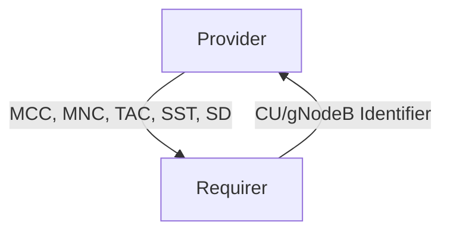

# `fiveg_core_gnb`

## Usage

Within 5G, the CU is the Central Unit of a RAN (Radio Access Network) and needs to be configured according to the 5G network parameters.

The `fiveg_core_gnb` relation interface describes the expected behavior of any charm claiming to be able to provide or consume the CU (or gNodeB) configuration information.

In a typical 5G network, the provider of this interface would be a CU or a gNodeB. The requirer of this interface would be the NMS (Network Management System).

## Direction



As with all Juju relations, the `fiveg_core_gnb` interface consists of two parties: a Provider and a Requirer.

## Behavior

Both the Requirer and the Provider need to adhere to criteria to be considered compatible with the interface.

### Provider

- Is expected to provide the following data:
  - TAC (Tracking Area Code)
  - List of PLMNs

The list of PLMNs should include the following data:
  - MCC (Mobile Country Code)
  - MNC (Mobile Network Code)
  - SST (Slice Service Type)
  - SD (Slice Differentiator)
    

### Requirer

- Is expected to provide a unique identifier of the CU (or gNodeB).

## Relation Data

[\[Pydantic Schema\]](./schema.py)

#### Example

```yaml
provider:
  app: {
    "tac": 1,
    "plmns": [
      {
        "mcc": "001",
        "mnc": "01",
        "sst": 1,
        "sd": 1,
      }
    ],
  }
  unit: {}
requirer:
  app: {
    "gnb-name": "gnb001"
  }
  unit: {}
```
