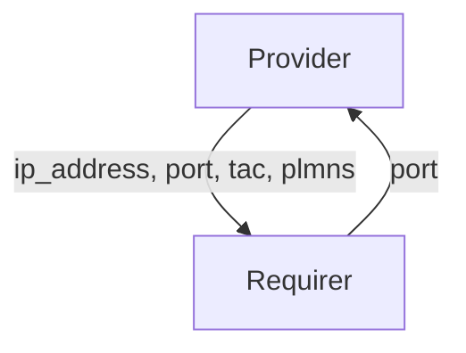

# `fiveg_f1`

## Usage

Within 5G RAN (Radio Access Network) architecture, the Functional Split (F1) interface facilitates communication between the Central Unit (CU) and the Distributed Unit (DU).

This relation interface describes the expected behavior of any charm claiming to be able to provide or consume information on connectivity over the F1 interface.

## Direction



As with all Juju relations, the `fiveg_f1` interface consists of two parties: a Provider and a Requirer.

## Behavior

Both the Requirer and the Provider need to adhere to criteria to be considered compatible with the interface.

### Provider

- Is expected to provide the following data:
  - IP address of the network interface used for F1 traffic
  - Number of the port used for F1 traffic
  - TAC (Tracking Area Code)
  - List of PLMNs

The list of PLMNs should include the following data:
  - MCC (Mobile Country Code)
  - MNC (Mobile Network Code)
  - SST (Slice Service Type)
  - SD (Slice Differentiator)

### Requirer

- Is expected to use the IP address and the port passed by the provider to establish communication over the F1 interface.
- Is expected to provide the number of the port which will handle communication over the F1 interface.

## Relation Data

[\[Pydantic Schema\]](./schema.py)

#### Example

```yaml
provider:
  app: {
    "f1_ip_address": "192.168.70.132",
    "f1_port": 2153,
    "tac": 1,
    "plmns": [
      {
        "mcc": "001",
        "mnc": "01",
        "sst": 1,
        "sd": 1,
      }
    ],
  }
  unit: {}
requirer:
  app: {
    "f1_port": 2153
  }
  unit: {}
```
