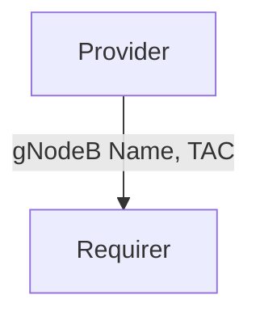

# `fiveg_gnb_identity`

## Usage

Within 5G, the gNodeB (a 5G base station) identity needs to be known by other components.

The `fiveg_gnb_identity` relation interface describes the expected behavior of any charm claiming to be able to provide or consume the gNodeB identity information.

In a typical 5G network, the provider of this interface would be a gNodeB. The requirer of this interface would be the NMS (Network Management System).

## Direction



As with all Juju relations, the `fiveg_gnb_identity` interface consists of two parties: a Provider and a Requirer.

## Behavior

Both the Requirer and the Provider need to adhere to criteria to be considered compatible with the interface.

### Provider

- Is expected to provide the name of the gNodeB and TAC (Traking Area Code).
    

### Requirer

- Is expected to use the name of the gNodeB name and TAC (Traking Area Code).

## Relation Data

[\[Pydantic Schema\]](./schema.py)

#### Example

```yaml
provider:
  app: {
    "gnb_name": "gnb001",
    "tac": 1
  }
  unit: {}
requirer:
  app: {}
  unit: {}
```
