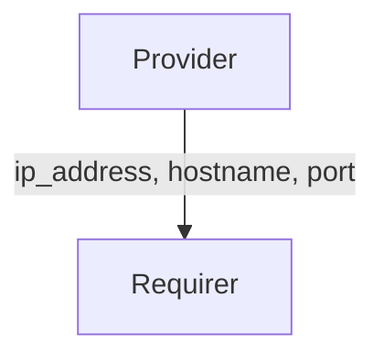

# `fiveg_n2`

## Usage

Within 5G, The Access and Mobility Management Function (AMF) is responsible for managing access and mobility for 5G devices. The 5G radio (gNodeB) communicates with the core’s control plane, specifically the AMF, using the N2 interface and the Next Generation Application Protocol (NGAP).

This relation interface describes the expected behavior of any charm claiming to be able to provide or consume information on connectivity to the N2 control plane.

## Direction



As with all Juju relations, the `fiveg_n2` interface consists of two parties: a Provider and a Requirer.

## Behavior

Both the Requirer and the Provider need to adhere to criteria to be considered compatible with the interface.

### Provider

- Is expected to provide the IP address, hostname and port of the AMF's N2 interface.

### Requirer

- Is expected to use the IP address, the hostname and the port passed by the provider (or a subset of them) to connect to the N2 interface.

## Relation Data

[\[Pydantic Schema\]](./schema.py)

#### Example

```yaml
provider:
  app: {
    "amf_ip_address": "192.168.70.132",
    "amf_hostname": "amf",
    "amf_port": "38412"
  }
  unit: {}
requirer:
  app: {}
  unit: {}
```
