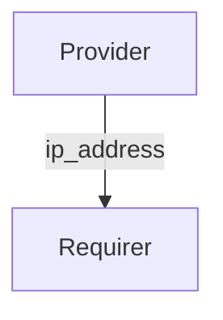

# `fiveg_n2`

## Usage

Within 5G, The Access and Mobility Management Function (AMF) is responsible for managing access and mobility for 5G devices.

This relation interface describes the expected behavior of any charm claiming to be able to provide or consume information on connectivity to the N2 plane.

## Direction



As with all Juju relations, the `fiveg_n2` interface consists of two parties: a Provider and a Requirer.

## Behavior

Both the Requirer and the Provider need to adhere to criteria to be considered compatible with the interface.

### Provider

- Is expected to provide the N2 interface IP address used to connect to AMF.

### Requirer

- Is expected to use the IP address passed by the provider to connect to the N2 interface.

## Relation Data

[\[Pydantic Schema\]](./schema.py)

#### Example

```yaml
provider:
  app: {"n2_ip_address": "192.168.251.6"}
  unit: {}
requirer:
  app: {}
  unit: {}
```
