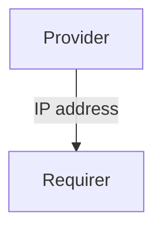

# `fiveg_n3`

## Usage

Within 5G, the User Plane Function (UPF) supports features and capabilities to facilitate 
user plane operation. Examples include: packet routing and forwarding, interconnection 
to the Data Network, policy enforcement and data buffering.

The `fiveg_n3` relation interface describes the expected behavior of any charm claiming to be able 
to provide or consume the UPF information in order to establish communication over the N3 interface. 
In a typical 5G network, the 'requirer' of this interface would be a gNodeB (a 5G base station). 

## Direction



As with all Juju relations, the `fiveg_n3` interface consists of two parties: a Provider 
and a Requirer.

## Behavior

Both the Requirer and the Provider need to adhere to criteria to be considered compatible 
with the interface.

### Provider

- Is expected to provide the UPF IP address.

### Requirer

- Is expected to use the UPF IP address to establish communication over the N3 interface.

## Relation Data

[\[Pydantic Schema\]](./schema.py)

#### Example

```yaml
provider:
  app: {"upf_ip_address": "1.2.3.4"}
  unit: {}
requirer:
  app: {}
  unit: {}
```
