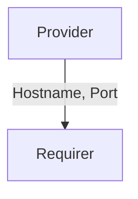

# `fiveg_n4`

## Usage

Within 5G, the User Plane Function (UPF) supports features and capabilities to facilitate 
user plane operation. Examples include: packet routing and forwarding, interconnection 
to the Data Network, policy enforcement and data buffering.

The `fiveg_n4` relation interface describes the expected behavior of any charm claiming to be able 
to provide or consume the UPF information in order to establish communication over the N4 interface. 
In a typical 5G network, the N4 interface is used between UPF and SMF. 

## Direction



As with all Juju relations, the `fiveg_n4` interface consists of two parties: a Provider 
and a Requirer.

## Behavior

Both the Requirer and the Provider need to adhere to criteria to be considered compatible 
with the interface.

### Provider

- Is expected to provide the hostname and the port of the UPF's N4 interface.

### Requirer

- Is expected to consume the hostname and the port of the UPF's N4 interface in order to establish 
  communication over that interface.

## Relation Data

[\[Pydantic Schema\]](./schema.py)

#### Example

```yaml
provider:
  app: {
    "upf_hostname": "upf.uplane-cloud.canonical.com",
    "upf_port": "8805"
  }
  unit: {}
requirer:
  app: {}
  unit: {}
```
