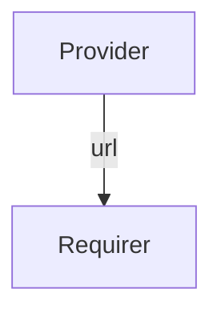

# `fiveg_nrf`

## Usage

Within 5G, the Network Repository Function (NRF) is responsible for providing information about discovered network function instances.

This relation interface describes the expected behavior of any charm claiming to be able to provide or consume NRF information.

## Direction



As with all Juju relations, the `fiveg_nrf` interface consists of two parties: a Provider and a Requirer.

## Behavior

Both the Requirer and the Provider need to adhere to criteria to be considered compatible with the interface.

### Provider

- Is expected to provide the NRF url.

### Requirer

- Is expected to use the provider's url to register itself and/or learn about registered network functions.

## Relation Data

[\[Pydantic Schema\]](./schema.py)

#### Example

```yaml
provider:
  app: {"url": "http://example-nrf.com:1234"}
  unit: {}
requirer:
  app: {}
  unit: {}
```
