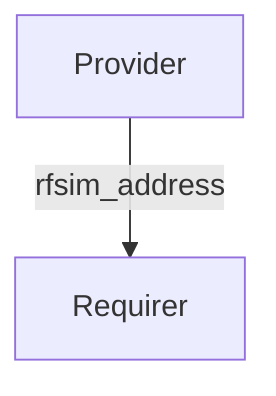

# `fiveg_rfsim`

## Usage

Within 5G RAN (Radio Access Network) architecture, the OAI DU charm can be started to act as both the DU and the RU through its RF simulator functionality. 

The OAI UE charm requires RF simulator address in order to connect. Hence, the provider of this interface would be a OAI DU charm and the requirer of this interface would be the OAI UE charm.

This relation interface describes the expected behavior of charms claiming to be able to provide or consume information on connectivity over the fiveg_rfsim interface.

## Direction



As with all Juju relations, the `fiveg_rfsim` interface consists of two parties: a Provider and a Requirer.

## Behavior

Both the Requirer and the Provider need to adhere to criteria to be considered compatible with the interface.

### Provider

- Is expected to provide the DU's `rfsim` service address including pod ip and service port.

### Requirer

- Is expected to use the `rfsim` service address passed by the provider.

## Relation Data

[\[Pydantic Schema\]](./schema.py)

#### Example

```yaml
provider:
  app: {
    "rfsim_address": "192.168.70.130",
  }
  unit: {}
requirer:
  app: {}
  unit: {}
```
