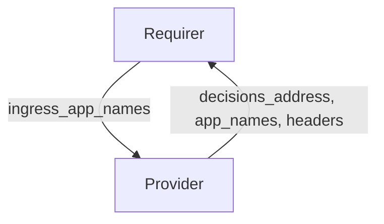

# `forward_auth`

## Usage

This relation interface describes the expected behavior of charms claiming to be able to set up an Identity and Access Proxy (IAP).

## Direction

The interface will consist of a provider and a requirer.

The provider is expected to supply configuration required to connect its Policy Decision Point with an API Gateway: decisions address, headers and names of applications (charms) to be protected by Identity and Access Proxy.

The requirer will read the information from the application databag and update its configuration to forward authentication to the external service.
It is expected to write to the databag a list of names of applications it provides ingress to.

That list will be compared by the interface with application names that are related to Oathkeeper via `auth-proxy` (and forwarded to `forward-auth` as `app_names`).
The interface will evaluate whether those applications have ingress configured and are thus eligible for requesting Identity and Access Proxy protection.



## Behavior

Both the requirer and the provider need to adhere to a certain set of criteria to be considered compatible with the interface:

### Provider

- Is expected to provide a Policy Decision Point in IAP architecture
- Must be able to authorize incoming HTTP requests.

### Requirer

- Is expected to be able to delegate authentication to an external service, e.g. with the use of Traefik ForwardAuth middleware
- Is expected to transform incoming `forward_auth` data into relevant configuration (e.g. traefik routes)
- Is expected to provide ingress controller-like capabilities to its related applications
- Is expected to provide a list of names of applications that are related via one of the ingress interfaces.

## Relation Data

### Provider

[\[JSON Schema\]](./schemas/provider.json)

#### Example

```json
{
  "application_data": {
    "decisions_address": "https://oathkeeper-0.oathkeeper-endpoints.namespace.svc.cluster.local:4456/decisions",
    "app_names": ["some-charm", "some-other-charm"],
    "headers": ["X-User", "X-Some-Header"]
  }
}
```

### Requirer

[\[JSON Schema\]](./schemas/requirer.json)

#### Example

```json
{
  "application_data": {
    "ingress_app_names": ["charmed-app", "other-charmed-app"]
  }
}
```
