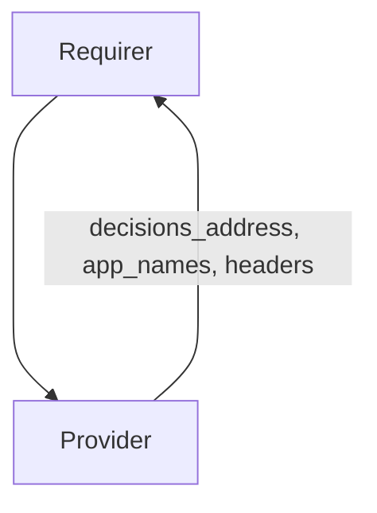

# `forward_auth`

## Usage

This relation interface describes the expected behavior of charms claiming to be able to set up an Identity and Access Proxy (IAP).

## Direction

The interface will consist of a provider and a requirer.

The provider is expected to supply configuration required to connect its Policy Decision Point with an API Gateway: decisions address, headers and names of applications (charms) to be protected by Identity and Access Proxy.

The requirer will read the information from the application databag and update its configuration to forward authentication to the external service.
It will not write to the application databag.



## Behavior

Both the requirer and the provider need to adhere to a certain set of criteria to be considered compatible with the interface:

### Provider

- Is expected to provide a Policy Decision Point in IAP architecture
- Must be able to authorize incoming HTTP requests.

In the current architecture, [oathkeeper-operator](https://github.com/canonical/oathkeeper-operator) is the only known provider.

### Requirer

- Is expected to be able to delegate authentication to an external service, e.g. with the use of Traefik ForwardAuth middleware
- Is expected to transform incoming `forward_auth` data into relevant configuration (e.g. traefik routes).

In the current architecture, [traefik-k8s-operator](https://github.com/canonical/traefik-k8s-operator) is the only requirer, however nginx can be considered as its equivalent for machine charms.

## Relation Data

### Provider

[\[JSON Schema\]](./schemas/provider.json)

#### Example

```json
{
  "application_data": {
    "decisions_address": "http://oathkeeper-0.oathkeeper-endpoints.namespace.svc.cluster.local:4456/decisions",
    "app_names": ["some-charm", "some-other-charm"],
    "headers": ["X-User", "X-Some-Header"]
  }
}
```

### Requirer

[\[JSON Schema\]](./schemas/requirer.json)

n/a
