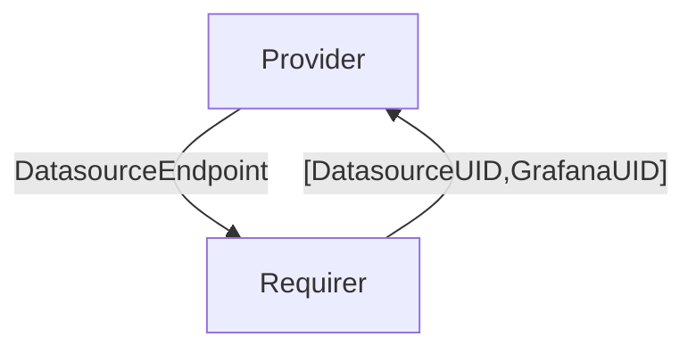

# `grafana_datasource`

## Usage

This relation interface describes the expected behavior of any charm claiming to be able to provide a grafana datasource.

In most cases, this will be accomplished using the [grafana_source library](https://github.com/canonical/grafana-k8s-operator/blob/main/lib/charms/grafana_k8s/v0/grafana_source.py), although charm developers are free to provide alternative libraries as long as they fulfill the behavioral and schematic requirements described in this document.

## Direction
The `grafana_datasource` interface implements a provider/requirer pattern.
The provider is a charm that implements a grafana datasource-compatible endpoint, and the requirer is a charm that is able to use such an endpoint to query the data.

The requirer is furthermore expected to share back to the provider:
- a unique identifier assigned to the source. This can be used by the provider to share with other charms for data correlation and cross-referencing purposes.
- a unique identifier for the grafana application itself.



## Behavior

The requirer and the provider need to adhere to a certain set of criteria to be considered compatible with the interface.

### Provider

- Is expected to expose a server implementing [the grafana source HTTP API](https://grafana.com/docs/grafana/latest/developers/http_api/data_source/).
- Is expected to communicate said endpoint URL over unit data, as each unit will expose its own server. 

### Requirer

- Is expected to share back via application data a mapping from provider unit names to unique datasource IDs. 
- Is expected to share back via application data a unique ID for the grafana application.

## Relation Data

[\[Pydantic model\]](./schema.py)


### Requirer


Additionally to a subset of the the (mandatory) [juju topology fields](https://discourse.charmhub.io/t/juju-topology-labels/8874), 
the requirer is expected to share the following fields:
- `type`: the grafana datasource type. For the possible values see [the upstream docs](https://grafana.com/docs/grafana/latest/datasources/#built-in-core-data-sources). Required.
- `extra_fields`: used to configure certain datasources. Maps to the `jsonData` field. Optional.
- `secure_extra_fields`: used to configure certain datasources. Maps to the `secureJsonData` field. Optional.

The whole configuration is expected to be json-encoded and nested under a `grafana_source_data` 
toplevel field.

#### Example

```yaml
application_data: {
  grafana_source_data:
      {
        model: cos,
        model_uuid: 0000-0000-0000-0000,
        application: tempo,
        type: tempo,
        extra_fields: {
          some: value 
        },
        secure_extra_fields: {
          some: password 
        },

      } 
}
```

### Provider

The provider is expected to share back a unique identifier for each unit of the requirer, as a mapping.
This will be encoded as a json dict and nested under the `datasource_uids` field in the application databag.
Also, is expected to share back a unique ID for the grafana application.

#### Example
```yaml
application-data: {
 grafana_uid: 0000-0000-0000-0000,
 datasource_uids: {
  "tempo/0": 0000-0000-0000-0001, 
  "tempo/1": 0000-0000-0000-0002,
 }
}
```
