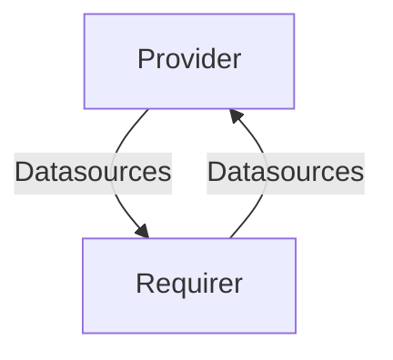

# `grafana_datasource_exchange`

The `grafana_datasource_exchange` interface allows charms that generate telemetry and have a reference to the datasources where said telemetry is queriable, 
to share those references to other charms for correlation and cross-referencing purposes. 

## Usage

This document describes the expected behavior of any charm exposing a `grafana_datasource_exchange` endpoint.

The reference implementation for this interface is implemented in the [`cosl`](https://github.com/canonical/cos-lib) library.
Charm developers are free to provide alternative libraries as long as they fulfill the behavioral and schematic requirements described in this document.

## Direction
The `grafana_datasource_exchange` interface implements a symmetrical provider/requirer pattern. 
Symmetrical, in the sense that the role doesn't matter and the data to be exchanged is the same for the requirer and the provider.



## Behavior

The requirer and the provider need to adhere to a certain set of criteria to be considered compatible with the interface.

### Provider & Requirer

- Is expected to expose a server implementing [the grafana source HTTP API](https://grafana.com/docs/grafana/latest/developers/http_api/data_source/). In other words, it's expected to expose one or more valid grafana datasources.
- Is expected to register each datasource endpoint (one per unit) with a central grafana application and obtain a Datasource UID for each one of them. 
- Is expected to share via application data, as a json-encoded array (sorted by UID), the following information:
  - for each datasource (which technically will likely mean, for each unit of the application):
    - the datasource UID: an arbitrary string, uniquely identifying the datasource
    - the grafana UID: an arbitrary string uniquely identifying a grafana instance
    - the datasource type: a grafana datasource type name (typically will be [one of the built-in ones](https://grafana.com/docs/grafana/latest/datasources/#built-in-core-data-sources))
    
To avoid complexity, we stipulate that the data will be provided in bulk: only 'fully specified' datasources will be shared, i.e. this is not a valid databag state:

```yaml
application_data: {
  datasources:
    [
      {
        type: tempo,
      },
    ]
}
```

In other words, if the application still has to hear back from Grafana what the UID of the datasource is, it should **not** add it to its `grafana_datasource_exchange` endpoints.
Only when it knows what UID is assigned to a datasource, then will it add the datasource to this relation.


## Relation Data

[\[Pydantic model\]](./schema.py)

#### Example

```yaml
application_data: {
  datasources:
    [
      {
        type: tempo,
        uid: 0000-0000-0000-0001,
        grafana_uid: 0000-0000-0000-0002,
      },
      {
        type: prometheus,
        uid: 0000-0000-0000-0003,
        grafana_uid: 0000-0000-0000-0004,
      },
    ]
}
```

#### Notes

- Since this interface is symmetrical, each application will likely have to implement both a requirer and a provider endpoint for it, to avoid having strange constraints on the integration topology.
- The data that is being exchanged comes in part from the application themselves (the datasource type), but in part from another integration (Grafana assigns the UIDs and communicates them back via the `grafana_datasource` interface). Since we cannot assume which integration is created first and what the event sequence will look like, this interface cannot commit to a specific event by which the data should be written. Instead, the only guarantee an implementer should give, is that _eventually_ the data will be provided.
- The 'sorting by UID' feature is required to prevent the databag hash to keep flapping and trigger endless cascades of relation-changed events.