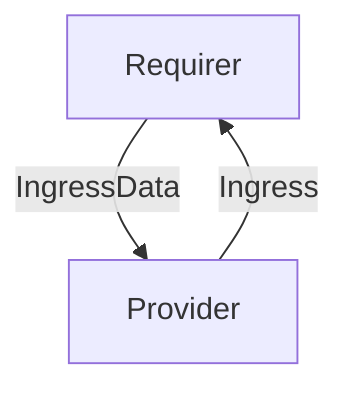

# `ingress`

## Usage

This relation interface describes the expected behavior of any charm claiming to be able to provide or consume ingress data.

In most cases, this will be accomplished using the [ingress library](https://github.com/canonical/traefik-k8s-operator/blob/main/lib/charms/traefik_k8s/v1/ingress.py), although charm developers are free to provide alternative libraries as long as they fulfill the behavioral and schematic requirements described in this document.

## Direction
The `ingress` interface implements a provider/requirer pattern.
The requirer is a charm that wishes to receive ingress, and the provider is a charm able to provide it.



## Behavior

The requirer and the provider need to adhere to a certain set of criteria to be considered compatible with the interface.

### Provider

- Is expected to provide ingress for the remote applications requesting it.
- Is expected to respect the ingress parameters sent by the requirer: hostname, port and model name (namespace).
- Is expected to publish the ingress url via relation data.
  The url is expected to have (by default) the following structure:

    > `http://[host]:[port]/[model]-[unit]/`
    
  where: 
  - `host` is the hostname that the ingress is configured with
  - `model` is the name of the model the application requesting ingress is deployed into
  - `unit` is the name of the unit this address leads to, with `/` replaced by `-` (E.g. `myapp/0` becomes `myapp-0`).
  - `port` is the ingressed port in the unit.
    
  The structure of this URL is fixed in the generic ingress schema; specific ingress providers implementations may offer some way of customising it.    

### Requirer

- Is expected to provide a hostname, and a model name (namespace). 
- Is expected to provide, for each unit requesting ingress, a port and a unit name.  

## Relation Data

Pydantic schemas for provider and requirer can be found [\[here\]](./schema.py)

### Requirer

Exposes the unit name (`name`), model name (`model`), hostname (`host`) and port (`port`) at which ingress should be provided. 
`name` and `model` should be placed in the **application** databag. `host` and `port`, as they will differ per ingressed unit, 
will be placed in the **unit** databags of the respective ingress-requesting units.
Depending on the library being used (and the provider charm), additional configuration keys may be supported. 

#### Example
```yaml
application-data: {
 name: "app_name",
 model: "model_name"
}
unit-data: {
 host: "hostname",
 port: 4242,
}
```

### Provider

Exposes a `url` field containing the url at which ingress is available. Should be placed in the **application** databag.

#### Example

```yaml
application_data: {
  ingress:
    url: "http://foo.bar:80/model_name-app_name/0"
}
```

