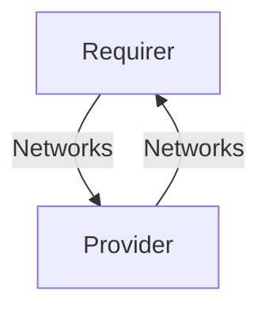

# `ip_router`

## Usage

The `ip_router` relation interface describes the expected behavior of any charm claiming to be able 
to provide or consume IP routes.

## Direction



As with all Juju relations, the `ip_router` interface consists of two parties: a Provider and a Requirer.

## Behavior

Both the Requirer and the Provider need to adhere to criteria to be considered compatible with the interface.

### Requirer

- Is expected to provide a list of networks, each containing a gateway and routes

### Provider

- Is expected to have an interface available at the gateway address provided by the requirer
- Is expected to implement the requested routes provided by the requirer
- Is expected to provide the list of networks it contains

## Relation Data

[\[Pydantic Schema\]](./schema.py)

#### Example

```yaml
requirer:
  app: {
    "networks": [
      {
        "network": "192.168.250.0/24",
        "gateway": "192.168.250.1",
        "routes": [
          {
            "destination": "172.250.0.0/16",
            "gateway": "192.168.250.3"
          }
        ]
      }
    ]
  }
  unit: { }
provider:
  app: {
    "networks": [
      {
        "network": "192.168.250.0/24",
        "gateway": "192.168.250.1",
        "routes": [
          {
            "destination": "172.250.0.0/16",
            "gateway": "192.168.250.3"
          }
        ]
      },
      {
        "network": "192.168.252.0/24",
        "gateway": "192.168.252.1",
      },
      {
        "network": "192.168.251.0/24",
        "gateway": "192.168.251.1/24"
      }
    ]
  }
  unit: { }
```
