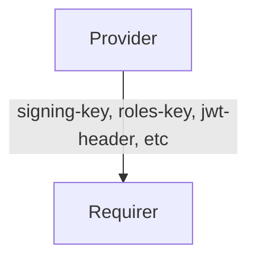

# `jwt`

## Overview

This relation interface describes the expected behavior of any charm providing or requiring configuration options for self-contained JSON Web Tokens (JWT).
Self-contained JWTs are tokens that include all the necessary information for validation within the token itself, enabling APIs to verify them without making external calls.
The approach involves adding key information directly to the JWT header, which APIs can extract and pass to a JWT validation library.

## Usage

Charms claiming to provide this interface must provide sensitive information (such as the signing key) via Juju secrets to the requirer.

The secret is expected to have the following content:
```
cuni0uh34trs5tihuf9g:
[...]
  content:
    signing-key: |2
              -----BEGIN PUBLIC KEY-----
              MIGfMA0GCSqGSIb3DQEBAQUAA4GNADCBiQK...
              -----END PUBLIC KEY-----
```

## Direction

The `jwt` interface implements a provider/requirer pattern.
The requirer is a charm that wishes to apply the JWT configuration to its workload, and the provider is a charm exposing the configuration options.



## Behavior

The requirer and the provider must adhere to a certain set of criteria to be considered compatible with the interface.

### Provider

- Is expected to always provide its mandatory configuration options (`signing-key`, `roles-key`).
- Is expected to provide its optional configuration options (`jwt-header`, `jwt-url-parameter`, `subject-key`, `required-audience`, `required-issuer`, `jwt-clock-skew-tolerance`) if a value has been set for them.
- Is expected to place the `signing-key` in a juju secret and provide the juju secret ID in the relation databag (`signing-key`).
- Is expected to provide all non-sensitive information in the relation databag.

As mentioned above the field `signing-key` holds the id of a Juju Secret, this means that the charms implementing the relation must be running on Juju >3 in order be able to use Juju secrets.

### Requirer

- Is expected to use all the JWT configuration provided.
- Must support Juju secrets.
- Is not expected to write anything to the databag.

## Relation Data

### Provider

[\[JSON Schema\]](./schemas/provider.json)

Provider provides its configurations in the **application** databag and the `signing-key` as a Juju secret.

#### Example

```yaml
related-units: {}
application_data: {
  "signing-key": "secret:cuni0uh34trs5tihuf9g",
  "roles-key": "roles",
  "jwt-header": "Authorization",
  "jwt-url-parameter": "jwt",
  "subject-key": "user",
  "required-audience": "opensearch",
  "required-issuer": "my-identity-provider",
  "jwt-clock-skew-tolerance": "60",
}
```
