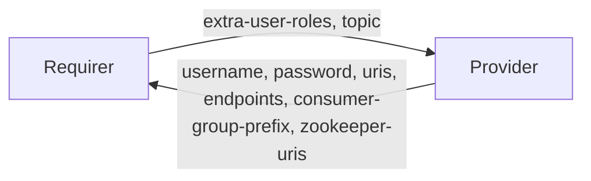

# `kafka_client`


## Usage

This relation interface describes the expected behavior of any charm claiming to be able to interface with a Kafka cluster as a client. For the majority of charms seeking to relate to a Kafka cluster, they will seek to do so as any of a producer, consumer or admin client.

- Producers can expect their desired topic/wildcard to be granted `WRITE`, `DESCRIBE`, `CREATE` topic ACLs matching their application credentials upon relation. Producer clients then can create their own topics using whichever client-library they wish, setting any topic level configuration then (e.g `replication-factor` and `partitions`).
- Consumers can expect to be granted ACLs for a specified topic with `READ`, `DESCRIBE` on topic, and `READ` on a wildcard-suffixed consumer-group upon relation. 
- Admins can expect to be granted super-user permissions for their application credentials upon relation.

## Terminology

The key words "MUST", "MUST NOT", "REQUIRED", "SHALL", "SHALL NOT", "SHOULD", "SHOULD NOT", "RECOMMENDED", "NOT RECOMMENDED", "MAY", and "OPTIONAL" in this document are to be interpreted as described in [RFC2119](https://www.rfc-editor.org/rfc/rfc2119).

## Direction



## Behavior

Both the Requirer and the Provider MUST adhere to the criteria, to be considered compatible with the interface.

### Provider
- MUST create an application `username` and `password` inside the Kafka cluster when the requirer relates to the Kafka cluster, stored in ZooKeeper
- MUST delete an application `username` and `password` from the Kafka cluster when the relation is removed
- MUST provide the `uris` field with a comma-separated list of broker uris, which can be used for cluster connection.
- MAY provide `endpoints` field with a comma-separated list of broker hostnames / IP addresses. If not provided, MUST be able to be extracted from the `uris` field
- If requirer `extra-user-roles` includes `consumer`, MUST provide the `consumer-group-prefix` field with the prefixed consumer groups
    - MUST NOT if requirer `extra-user-roles` includes `consumer`
- If the requirer `extra-user-roles` includes `admin`, MUST provide the `zookeeper-uris` field with a comma-separated list of ZooKeeper server uris and Kafka cluster zNode for direct ZooKeeper connection
    - MUST NOT if requirer `extra-user-roles` does not include `admin`
- MUST provide a valid CA to the client for encrypted communication to the Kafka cluster in the `tls-ca` field if the cluster is currently configured for TLS
    - SHOULD NOT if the cluster is not configured for TLS

### Requirer
- MUST provide the `extra-user-roles` field specifying a comma-separated list of roles for the client application (between `admin`, `consumer` and `producer`)
- SHOULD provide the `topic` field specifying the topic that the requirer charm needs permissions to create (for `extra-user-roles=producer`), or consume (for `extra-user-roles=consumer`)
    - This can only be omitted when the client has also specified `extra-user-roles=admin`

## Relation Data

### Provider

[\[JSON Schema\]](./schemas/provider.json)

Provider provides application credentials and server connection uris. It should be placed in the **application** databag.


#### Example
```yaml
  relation-info:
  - endpoint: kafka_client
    related-endpoint: kafka_client
    application-data:
      username: user123
      password: Dy0k2UTfyNt2B13cfe412K7YGs07S4U7
      uris: 10.141.78.155:9092,10.141.78.62:9092,10.141.78.186:9092
      endpoints: 10.141.78.155,10.141.78.62,10.141.78.186
      consumer-group-prefix: user123-
      zookeeper-uris: 10.141.78.133:2181,10.141.78.50:2181,10.141.78.45:2181/kafka

```

### Requirer

[\[JSON Schema\]](./schemas/requirer.json)

Requirer provides application role and topic. It should be placed in the **application** databag.

#### Example

```yaml
  relation-info:
  - endpoint: kafka_client
    related-endpoint: kafka_client
    application-data:
        extra-user-roles: consumer,producer
        topic: special-topic
```
