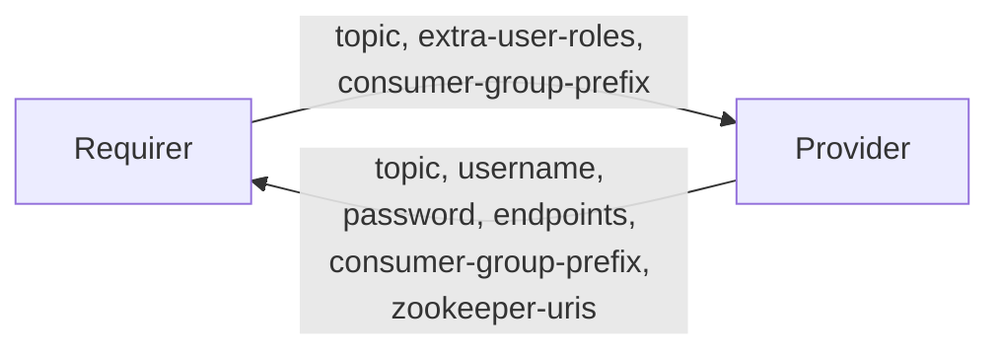

# `kafka_client`

## Usage

This relation interface describes the expected behavior of any charm claiming to be able to interface with a Kafka cluster as a client. For the majority of charms seeking to relate to a Kafka cluster, they will seek to do so as any of a producer, requirer or admin client.

- Producers can expect their desired topic/wildcard to be granted `WRITE`, `DESCRIBE`, `CREATE` topic ACLs matching their application credentials upon relation. Producer clients then can create their own topics using whichever client-library they wish, setting any topic level configuration then (e.g `replication-factor` and `partitions`).
- Consumers can expect to be granted ACLs for a specified topic with `READ`, `DESCRIBE` on topic, and `READ` on a wildcard-suffixed consumer-group upon relation. 
- Admins can expect to be granted super-user permissions for their application credentials upon relation.

## Direction



## Behavior

Both the Requirer and the Provider need to adhere to the criteria, to be considered compatible with the interface.

### Provider
- Is expected to create an application `username` and `password` inside the kafka cluster when the requirer relates to the kafka cluster, using the SASL/SCRAM mechanism, stored in ZooKeeper.
- Is expected to delete an application `username` and `password` from the kafka cluster when the relation is removed.
- Is expected to provide a custom entity `entity-name` and `entity-password` inside the kafka cluster when the requirer relates to the kafka cluster when the `entity-type` field is supplied.
- Is expected to delete a custom entity `entity-name` and `entity-password` from the kafka cluster when the relation is removed.
- Is expected to provide the `endpoints` field with a comma-seperated list of broker hostnames / IP addresses.
- Is expected to provide the `topic` field with the topic that was actually created.
- Can optionally provide the `consumer-group-prefix` field with the prefixed consumer groups, if requirer `extra-user-roles` is includes `consumer`
- Can optionally provide the `zookeeper-uris` field with a comma-seperated list of ZooKeeper server uris and Kafka cluster zNode, if the requirer `extra-user-roles` includes `admin`

### Requirer
- Can optionally provide the `topic` field specifying the topic that the requirer charm needs permissions to create (for `extra-user-roles=producer`), or consume (for `extra-user-roles=consumer`).
- Is expected to tolerate that the Provider may ignore the `topic` field in some cases and instead use the topic name received.
- Is expected to provide the `extra-user-roles` field specifying a comma-separated list of roles for the requested user or client application (between `admin`, `consumer` and `producer`).
- Can optionally provide the `extra-group-roles` field specifying a comma-separated list of roles for the requested group (e.g. `extra-group-roles=admin`).
- Can optionally provide the `entity-type` field specifying the type of entity to request, instead of a topic.
- Can optionally provide the `entity-permissions` field specifying the permissions for the requested entity.
- Can optionally provide the `consumer-group-prefix` field specifying the consumer-group-prefix that the requirer charm needs permissions to consume (for `extra-user-roles=consumer`).

## Relation Data

### Provider

[\[JSON Schema\]](./schemas/provider.json)

Provider provides application credentials and server connection uris. It should be placed in the **application** databag.


#### Example
```yaml
  relation-info:
  - endpoint: kafka_client
    related-endpoint: kafka_client
    application-data:
      username: user123
      password: Dy0k2UTfyNt2B13cfe412K7YGs07S4U7
      endpoints: 10.141.78.155:9092,10.141.78.62:9092,10.141.78.186:9092
      consumer-group-prefix: user123-
      zookeeper-uris: 10.141.78.133:2181,10.141.78.50:2181,10.141.78.45:2181/kafka

```

### Requirer

[\[JSON Schema\]](./schemas/requirer.json)

Requirer provides application role and topic. It should be placed in the **application** databag.

#### Example

```yaml
  relation-info:
  - endpoint: kafka_client
    related-endpoint: kafka_client
    application-data:
        extra-user-roles: consumer,producer
        topic: special-topic
        consumer-group-prefix: "my-consumer-group"
```
