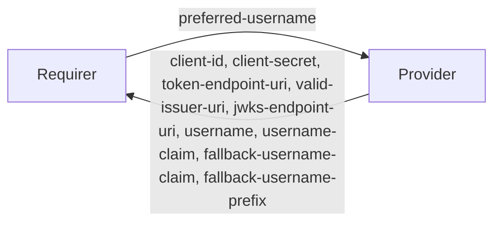

`kafka_oauth`

## Usage

This relation interface describes the expected behavior of any charm claiming to be able to interface with a Kafka cluster as an integrator between an OAuth Authorization Server external to the Juju model, and said cluster. Charms providing this relation interface are expected to facilitate the automatic creation and removal of inter-broker users for an active `kafka_oauth` relation to the provider.


## SECTION CAN BE REMOVED ONCE CONFIRMED - OAuth Flow

Expected relation flow is as follows:

1. Kafka Charm relates to Provider Charm, passing the `preferred-username` for inter-broker auth
2. The Provider charm attempts to create the user specified in Step.1 on the Authorization Server, and retreives the `client-id` and `client-secret`, as well as any necessay connection `uris` and `username-claim`s set on the Server
    - @grobbie - Does Kafka need it's Auth Server password?
3. Provider Charm passes this information back to the Kafka Charm, which can then set those values to it's config and then rolling-restart
4. Administrator creates an account for the desired client application (e.g producer/consumer) on the Authorization Server, generating a `username`, `password`, `client-id` and `client-secret`
5. Client Application uses the credentials generated by the Administrator in Step.4 to make a connection to the Kafka Charm
6. The Kafka Charm receives a request roughly with the following encrypted token:
    ```
    {
        "client-id": 6779ef20e75817b79602
        "client-secret": 0oa2hl2inow5Uqc6c357
    }
    ```
7. Kafka Charm passes the token to the provided `valid-issuer-uri` for decoding and validation
8. Kafka Charm recieves back from the Authorization Sever a token roughly with the following:
    ```
    {
        "username": "client-producer-1"  # `username` field provided to Kafka Charm by Provider in `username-claim` field
        "password": v9mMVsKRcWq92uw5AejsqSOMYyleV4jS
    }
    ```
8. Kafka Charm creates SASL credentials for principal `User:client-producer-1` with password `v9mMVsKRcWq92uw5AejsqSOMYyleV4jS`. In future, ACLs may also be set from provided token contents 
9. Client Application is now authenticated

## Terminology

The key words "MUST", "MUST NOT", "REQUIRED", "SHALL", "SHALL NOT", "SHOULD", "SHOULD NOT", "RECOMMENDED", "NOT RECOMMENDED", "MAY", and "OPTIONAL" in this document are to be interpreted as described in [RFC2119](https://www.rfc-editor.org/rfc/rfc2119).

## Direction



@grobbie - Do we want SSL for communication between Authorization Server + Brokers?

## Behavior

Both the Requirer and the Provider MUST adhere to the criteria, to be considered compatible with the interface.

### Provider
- MUST provide both the `client-id` and `client-secret` fields with values necessary for establishing an authorized connection to the external Authroization Server
- MUST provide `token-endpoint-uri` and `jwks-endpoint-uri` fields with values that facilitate Kafka brokers requesting OAuth2.0 access tokens and JWTs
- MUST provide the `valid-issuer-uri` field with values that facilitate Kafka brokers validating access external request credentials passed by clients
- MUST provide the `username` field containing the name of the user for inter-broker communication between Kafka brokers. If `preferred-username` is passed from the Requirer, attempt to use this name. If this name is taken, MUST generate a new username
    - @grobbie - The Kafka cluster doesn't need to know the Auth Server password does it?
- MUST provide the `username-claim`, `fallback-username-claim` and `fallback-username-prefix` fields with values that allow the Kafka cluster to evaluate passed tokens and generate SASL principals within the cluster

### Requirer
- MAY provide the `preferred-username` field for identifying the Kafka cluster to the Authorization Server

## Relation Data

### Provider

[\[JSON Schema\]](./schemas/provider.json)

Provider provides application credentials and connection uris. It MUST be placed in the **application** databag.


#### Example
```yaml
  relation-info:
  - endpoint: kafka_oauth
    related-endpoint: kafka_oauth
    application-data:
        client-id: 6779ef20e75817b79602
        client-secret: 0oa2hl2inow5Uqc6c357
        token-endpoint-uri: http://localhost:8080/realms/kafka/protocol/openid-connect/token
        valid-issuer-uri: http://localhost:8080/realms/kafka
        jwks-endpoint-uri: http://localhost:8080/realms/kafka/protocol/openid-connect/certs
        username: kafka-brokers
        username-claim: username 
        fallback-username-claim: client_id
        fallback-username-prefix: kafka-client-user-
```

### Requirer

[\[JSON Schema\]](./schemas/requirer.json)

Requirer provides application role and topic. It MUST be placed in the **application** databag.

#### Example

```yaml
  relation-info:
  - endpoint: kafka_oauth
    related-endpoint: kafka_oauth
    application-data:
        preferred-username: kafka-inter-broker
```
