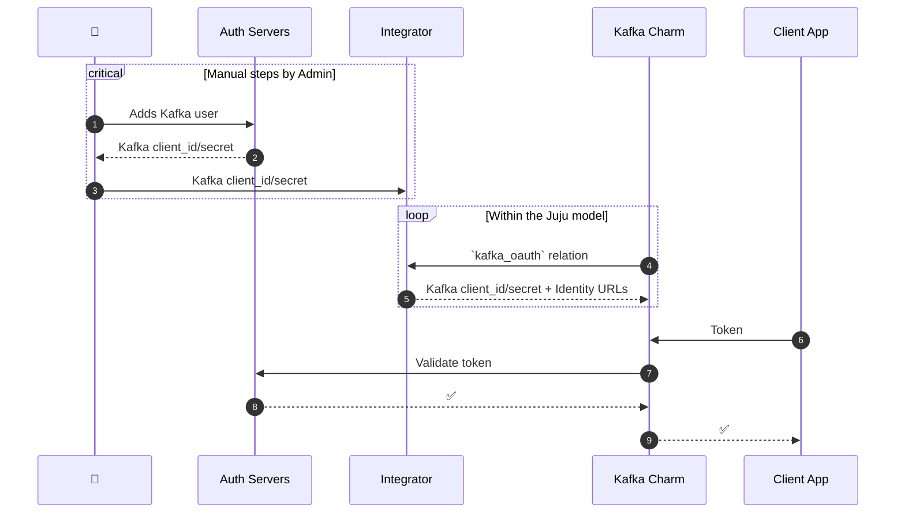
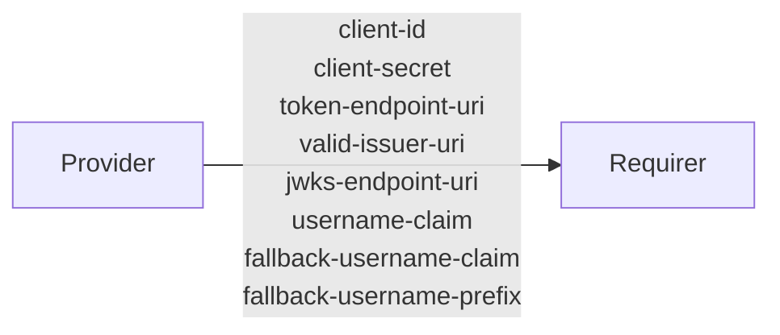

`kafka_oauth`

## Usage

This relation interface describes the expected behavior of any charm claiming to be able to interface with a Kafka cluster as an integrator between an OAuth Authorization Server external to the Juju model, and said cluster. Charms providing this relation interface are expected to facilitate the automatic creation and removal of inter-broker users for an active `kafka_oauth` relation to the provider.

It is expected that an administrator will create a user account on their Authorization Server that will be used for a Kafka Cluster, and retrieve a `client-id` and `secret`. The Administrator will then manually add these secrets to any Charm seeking to Provide the `kafka_oauth` relation. When a Kafka Charm relates to a Provider Charm on this interface, these secrets are to be passed to the Kafka Charm across relation data.

Each Kafka Charm deployment will require it's own Provider Charm.

## Terminology

The key words "MUST", "MUST NOT", "REQUIRED", "SHALL", "SHALL NOT", "SHOULD", "SHOULD NOT", "RECOMMENDED", "NOT RECOMMENDED", "MAY", and "OPTIONAL" in this document are to be interpreted as described in [RFC2119](https://www.rfc-editor.org/rfc/rfc2119).

## Direction

### Expected Sequence


### Relation


## Behavior

The Provider MUST adhere to the criteria, to be considered compatible with the interface.

### Provider
- MUST provide both the `client-id` and `client-secret` fields with values necessary for establishing an authorized connection to the external Authorization Server
- MUST provide `token-endpoint-uri` and `jwks-endpoint-uri` fields with values that facilitate Kafka brokers requesting OAuth2.0 access tokens and JWTs
- MUST provide the `valid-issuer-uri` field with values that facilitate Kafka brokers validating access external request credentials passed by clients
- MUST provide the `username-claim`, `fallback-username-claim` and `fallback-username-prefix` fields with values that allow the Kafka cluster to evaluate passed tokens and generate SASL principals within the cluster

## Relation Data

### Provider

[\[JSON Schema\]](./schemas/provider.json)

Provider provides application credentials and connection uris. It MUST be placed in the **application** databag.


#### Example
```yaml
  relation-info:
  - endpoint: kafka_oauth
    related-endpoint: kafka_oauth
    application-data:
        client-id: 6779ef20e75817b79602
        client-secret: 0oa2hl2inow5Uqc6c357
        token-endpoint-uri: http://localhost:8080/realms/kafka/protocol/openid-connect/token
        valid-issuer-uri: http://localhost:8080/realms/kafka
        jwks-endpoint-uri: http://localhost:8080/realms/kafka/protocol/openid-connect/certs
        username-claim: username 
        fallback-username-claim: client_id
        fallback-username-prefix: kafka-client-user-
```
