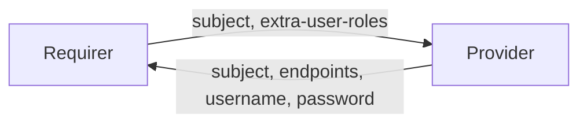

# `karapace_client`

## Usage

This relation interface describes the expected behavior of any charm claiming to be able to provide or consume Karapace client connections. For the majority of charms seeking to relate to a Karapace schema registry, they will seek to do so as a "user" or "admin" client.

- "User" clients can expect their desired subject to be granted `READ` access to the subject requested.
- Admins can expect to be granted super-user permissions for their application credentials upon relation.

## Direction

The `karapace_client` interface implements a provider/requirer pattern:
- **Provider**: A Karapace charm that can provide schema registry services
- **Requirer**: A charm that requires access to Karapace services for schema management



## Behavior

Both the Requirer and the Provider need to adhere to the criteria, to be considered compatible with the interface.

### Provider

- Is expected to create an application `username` and `password` inside the Karapace service when the requirer relates to Karapace.
- Is expected to delete an application `username` and `password` inside the Karapace service when the requirer removes the relation.
- Is expected to provide a custom entity `entity-name` and `entity-password` inside the Karapace cluster when the requirer relates to the Karapace cluster when the `entity-type` field is supplied.
- Is expected to delete a custom entity `entity-name` and `entity-password` from the Karapace cluster when the relation is removed.
- Is expected to provide the `endpoints` field with a comma-seperated list of IP addresses or hostnames.
- Is expected to provide the `subject` field with the subject to which the user should be granted access.
- Should create and manage subjects and ACLs based on requirer requests


**Expected behavior:**
- On relation joined, the provider should wait for subject information from the requirer
- On relation changed with subject data, the provider should:
  - Create the requested subject if it doesn't exist
  - Set up appropriate ACLs and permissions
  - Provide connection details in the application databag

### Requirer

- Is expected to request access to specific Karapace subjects by providing the `subject` field.
- Can optionally specify `extra-user-roles` field, being either `admin` or `user`.
- Can optionally provide the `entity-type` field specifying the type of entity to request, instead of a subject.
- Can optionally provide the `entity-permissions` field specifying the permissions for the requested entity.
- Can optionally provide the `extra-group-roles` field specifying a comma-separated list of roles for the requested group (e.g. `extra-group-roles=admin`).

**Expected behavior:**
- On relation changed with provider data, the requirer should:
  - Use the provided endpoints and credentials to connect to Karapace
  - Configure Karapace clients with the provided information

## Relation Data

### Provider

[\[JSON Schema\]](./schemas/provider.json)

Provider provides credentials and endpoints. It should be placed in the **application** databag.


#### Example
```yaml
  relation-info:
  - endpoint: karapace_client
    related-endpoint: karapace _client
    application-data:
      subject: test-subject
      username: user123
      password: Dy0k2UTfyNt2B13cfe412K7YGs07S4U7
      endpoints: 10.141.78.155:8082
```

### Requirer

[\[JSON Schema\]](./schemas/requirer.json)

Requirer specifies the subject and access requirements. It should be placed in the **application** databag.


#### Example

```yaml
  relation-info:
  - endpoint: karapace_client
    related-endpoint: karapace_client
    application-data:
        subject: test-subject
        extra-user-roles: admin
```
