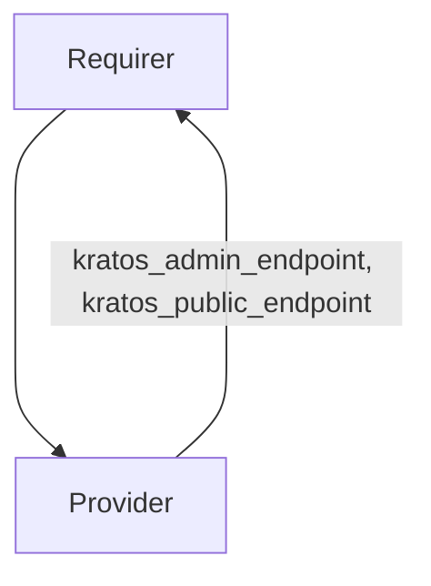

# `kratos_endpoints`

## Overview

This relation interface describes the expected behavior of charms claiming to be able to provide or consume a kratos endpoint.

## Usage

The interface will provide admin, public, login and sessions endpoints.

## Direction

The interface will consist of a provider and a requirer. The provider is expected to supply its public, admin, login and sessions endpoints,
while the requirer will just read the information from the application databag.



## Behavior

Both the requirer and the provider need to adhere to a certain set of criteria to be considered compatible with the interface:

### Provider

- Is expected to serve admin and public API endpoints
- Is expected to write the public, admin, login and sessions URLs to the application databag.

### Requirer

- Is expected to consume the relation data to set up integration with Kratos.

## Relation Data

### Provider

[\[JSON Schema\]](./schemas/provider.json)


#### Example


```json
{
  "application_data": {
    "admin_endpoint": "admin-endpoint",
    "public_endpoint": "public-endpoint",
    "login_browser_endpoint": "login-endpoint",
    "sessions_endpoint": "sessions-endpoint"
  }
}
```

### Requirer

[\[JSON Schema\]](./schemas/requirer.json)

n/a
