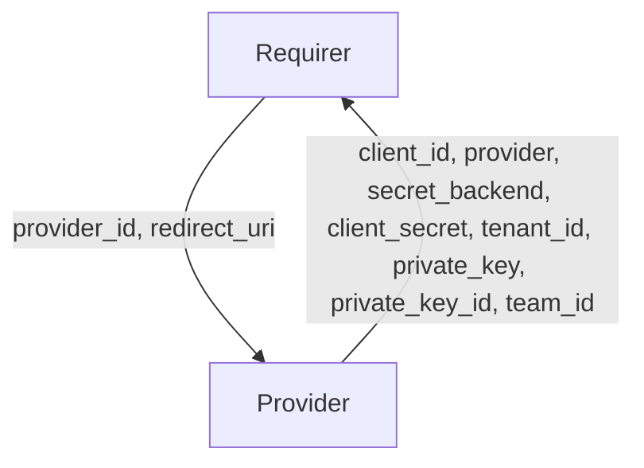

# `kratos_external_idp`

## Usage
This relation interface describes the expected behavior of any charm claiming to be able to interface with an Ory Kratos server as an integrator between an OIDC Provider external to the Juju model  and the Kratos charm. Charms providing this relation interface are expected to facilitate the automatic management of the client credentials from the Kratos server.

It is expected that an administrator will create the client credentials on the OP that will be used to authenticate Kratos, and retrieve a `client_id` and a `client_secret`. The Administrator will then manually add these secrets to any Charm seeking to provide the `kratos_external_idp` relation. When a Kratos Charm relates to a Provider Charm on this interface, these secrets are to be passed to the Kratos Charm across relation data. The Kratos charm then will place in the relation the redirect_uri and the provider_id for this client. Finally the admin has to provide the redirect_uri to the external OP.

## Terminology

The key words "MUST", "MUST NOT", "REQUIRED", "SHALL", "SHALL NOT", "SHOULD", "SHOULD NOT", "RECOMMENDED", "NOT RECOMMENDED", "MAY", and "OPTIONAL" in this document are to be interpreted as described in [RFC2119](https://www.rfc-editor.org/rfc/rfc2119).

## Direction



## Behavior

The Provider MUST adhere to the criteria, to be considered compatible with the interface.

### Provider
- MUST provide one or more provider configurations in the relation data bag.
- MUST provide the `client_id` field for each item.
- MUST provide the `provider` field for each item with the provider's type. `provider` must be one of: `generic`, `google`, `facebook`, `microsoft`, `github`, `apple`, `gitlab`, `auth0`, `slack`, `spotify`, `discord`, `twitch`, `netid`, `yander`, `vk`, `dingtalk`.
- MUST provide the `secret_backend` field for each item, with information about backend used to store the sensitive information (`client_secrets`, `apple_private_keys`). The `secret_backend` field MUST have one of the following values: `relation`, `secret`, `vault`.
- If `provider` is any of `generic` or `auth0` then the Provider MUST provider the `client_secret` and `issuer_url` fields under the corresponding key.
- If `provider` is any of `google`, `facebook`, `github`, `gitlab`, `slack`, `spotify`, `discord`, `twitch`, `netid`, `yandex`, `vkontakte` or `dingtalk` then the Provider MUST provide the `client_secret` field under the corresponding key.
- If `provider` is `microsoft` then the Provider MUST provide the `client_secret` and `tenant_id` fields under the corresponding key.
- If `provider` is `apple` then the Provider MUST provide the `team_id`, `private_key_id` and `private_key` fields under the corresponding key.

### Requirer
- MUST provide an array of `redirect_uri`s and `provider_id`s for each provider in the Provider's databag.
- If the Provider has placed in the databag a `provider_id`, the Requirer MUST provide the same ID.

## Relation Data

### Provider

[\[JSON Schema\]](./schemas/provider.json)

Provider provides client credentials and information about the external OP. It MUST be placed in the **application** databag.

#### Example
```yaml
  relation-info:
  - endpoint: kratos_external_idp
    relation-endpoint: kratos_external_idp
    application_data:
      providers:
        - client_id: client_id
          client_secret: cl1ent-s3cRet
          secret_backend: relation
          tenant_id: 4242424242424242
          provider: microsoft
```

### Requirer

[\[JSON Schema\]](./schemas/requirer.json)

Requirer provides a redirect_uri and provider_id for every provider. It should be placed in the **application** databag.

#### Example

```yaml
  relation-info:
  - endpoint: kratos_external_idp
    related-endpoint: kratos_external_idp
    application-data:
      providers:
        - redirect_uri: https://example.kratos.com/self-service/methods/oidc/callback/microsoft
          provider_id: microsoft
```

