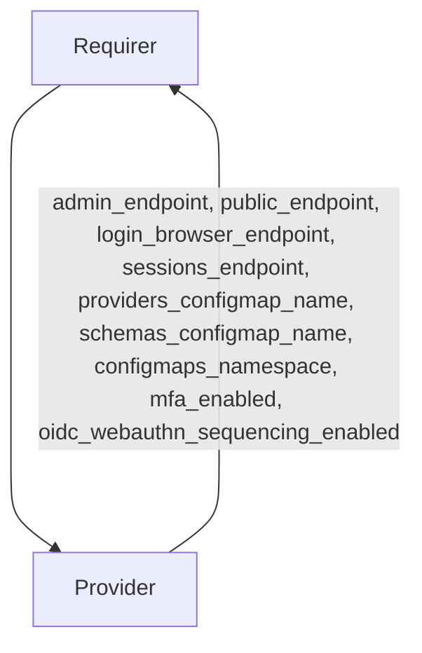

# `kratos_info`

## Usage

This integration interface provides kratos deployment info, such as endpoints,
namespace and ConfigMap details.

## Direction



## Behavior

Both the Requirer and the Provider need to adhere to criteria to be considered
compatible with the interface.

### Provider

- Is expected to provide public, admin, browser login, sessions endpoints
- Is expected to provide k8s ConfigMaps for storing IDP providers, identity
  schemas
- Is expected to provide the provider's k8s namespace
- Is expected to provide feature flags for MFA authentication and WebAuthn
  sequencing

### Requirer

- Is expected to consume the integration data to set up integration with Kratos

## Relation Data

### Provider

[\[Pydantic Schema\]](schema.py)

#### Example

```yaml
relation-info:
  - endpoint: kratos-info
    related-endpoint: kratos-info
    application-data:
      admin_endpoint: http://10.64.140.44/testing-kratos
      login_browser_endpoint: http://10.64.140.45/testing-kratos/self-service/login/browser
      public_endpoint: http://10.64.140.45/testing-kratos
      sessions_endpoint: http://10.64.140.45/testing-kratos/sessions/whoami
      providers_configmap_name: providers
      schemas_configmap_name: identity-schemas
      configmaps_namespace: testing
      mfa_enabled: false
      oidc_webauthn_sequencing_enabled: false
```
