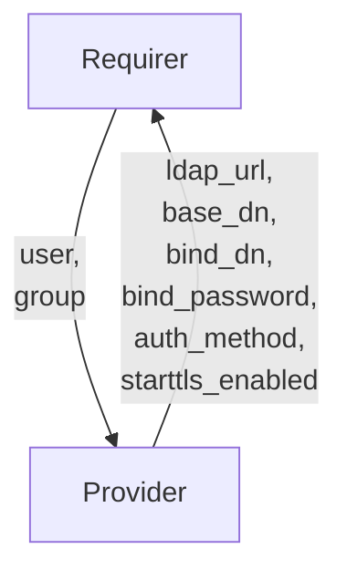

# `ldap`

## Usage

This relation interface describes the expected behavior of any charm claiming to
be able to provide or consume the LDAP authentication configuration data.

## Direction



## Behavior

Both the `provider` and the `requirer` need to adhere to a certain set of
criteria to be considered compatible with the `ldap` interface.

Sensitive information is transmitted through Juju Secrets rather than directly
through the relation databag(s).

### Provider

- Is expected to provide the `requirer` with necessary configuration for
  performing LDAP authentications and operations.
- Is expected to create a bind DN in the DIT (Data Information Tree) for
  the `requirer` to use for the `bind` operation.
- Is expected to update the application databag if any field's data is changed
  in the `provider` charmed application.

### Requirer

- Is expected to provide the client information for the `provider` to generate
  the bind DN. If it is not provided, the `provider` leverages `requirer`
  charmed operator's information by default.
- Is expected to consume the LDAP configuration data provided by the `provider`
  to configure the charmed application.
- Is expected to update the charmed application configuration when
  the `provider` updates the application databag.

**Note**: try to avoid
the [special characters](https://datatracker.ietf.org/doc/html/rfc2253#section-2.4)
for the `user` and `group` in the `requirer`'s databag.

## Relation Data

### Provider

The `provider` provides LDAP URL, base DN, and bind DN, and LDAP
authentication method for the `requirer` to connect and perform LDAP operations.
It should be placed in the **application** databag.

#### Example

```yaml
  relation-info:
    - endpoint: ldap
      related-endpoint: ldap
      application-data:
        ldap_url: ldap://ldap.canonical.com:3893
        base_dn: dc=canonical,dc=com
        bind_dn: cn=app,ou=model,dc=canonical,dc=com
        bind_password: secret://59060ecc-0495-4a80-8006-5f1fc13fd783/cjqub6vubg2s77p3nio0
        auth_method: simple
        starttls_enabled: true
``````

### Requirer

The `requirer` provides LDAP client information. It should be placed in the
**application** databag.

#### Example

```yaml
  relation-info:
    - endpoint: ldap
      related-endpoint: ldap
      application-data:
        user: sssd
        group: machine-localhost
```
