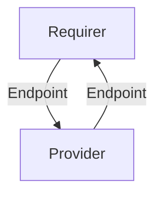

# `litmus_auth`

## Usage

This interface enables communication between the Litmus auth and backend
charms by primarily sharing each service’s gRPC server endpoints.

In most cases, this will be accomplished using the [litmus_auth library](https://github.com/canonical/litmus-operators/blob/main/libs/src/litmus_libs/interfaces/litmus_auth.py), although charm developers are free to provide alternative libraries as long as they fulfill the behavioral and schematic requirements described in this document.

## Direction

This interface implements a provider/requirer pattern. The provider is the auth server and the requirer is the backend server.

Information flows back and forth: The requirer shares its gRPC server endpoint, and the provider also shares its gRPC server endpoint.



## Behavior

### Provider

- Must publish its gRPC server's hostname and port.
- Must pass `insecure=True` if the gRPC server endpoint is incapable of accepting TLS connections.

### Requirer

- Must publish its gRPC server's hostname and port.
- Must pass `insecure=True` if the gRPC server endpoint is incapable of accepting TLS connections.

## Relation Data

[\[Pydantic Schema\]](./schema.py)

#### Example
A yaml/json example of a valid databag state (for the whole relation), in absence of an ingress 
integration for the provider:
```yaml
provider:
  app:
    grpc_server_host: provider.grpc.host
    grpc_server_port: 8080
    insecure: false
    version: 0
  unit:
requirer:
  app:
    grpc_server_host: requirer.grpc.host
    grpc_server_port: 3030
    insecure: false
    version: 0
  unit:
```
