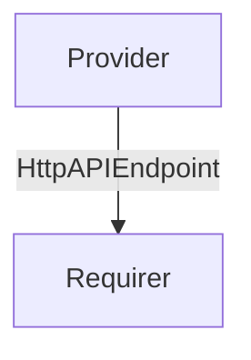

# `litmus_backend_http_api`

## Usage

This is an internal interface for the litmus chaos testing solution, meant for the backend component to communicate its http API endpoint to the chaoscenter frontend component.

## Direction

This interface implements a provider/requirer pattern, where the auth component **provides** an http endpoint to the chaoscenter application.



## Behavior

### Provider

- Must provide to the requirer a full cluster-internal (the solution does not support being distributed cross-model/controller) http(s) url of a litmus auth component server. 
    

### Requirer

- The requirer doesn't need to do anything.

## Relation Data

[\[Pydantic Schema\]](./schema.py)

#### Example
```yaml
provider:
  app: {
         version: 0,
         endpoint: "http://foo.com:2025/"
  }
  unit: {}
requirer:
  app: {}
  unit: {}
```
